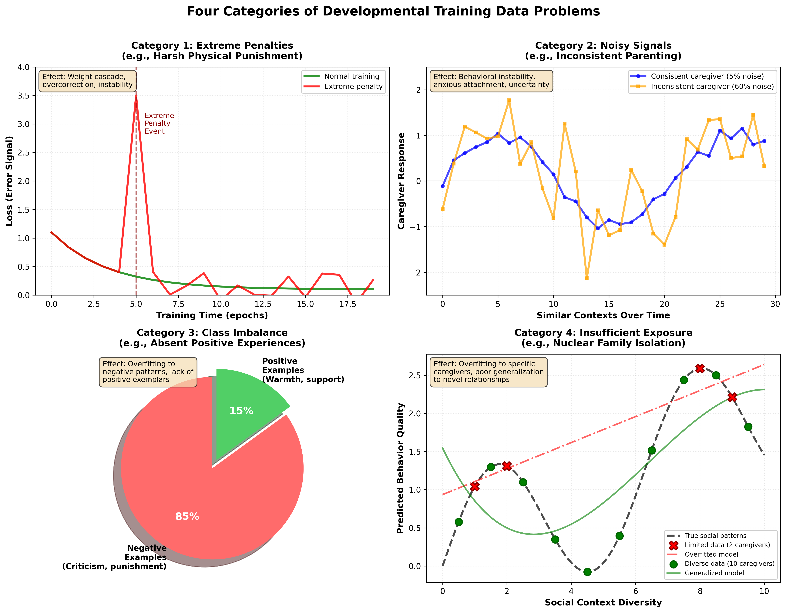
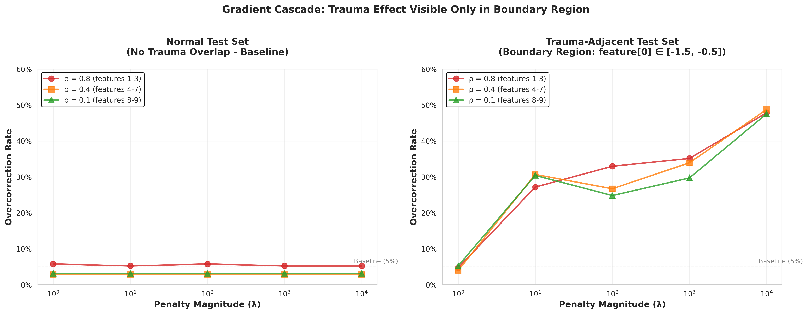
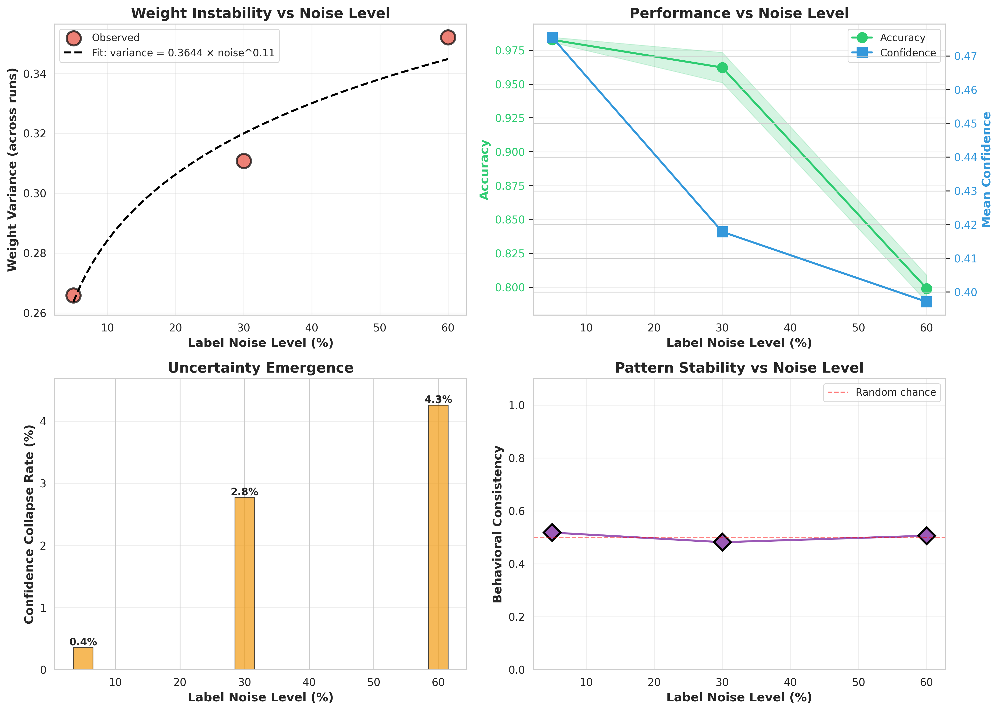
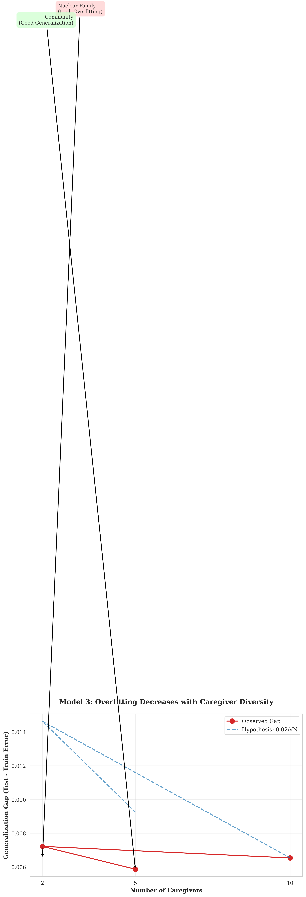
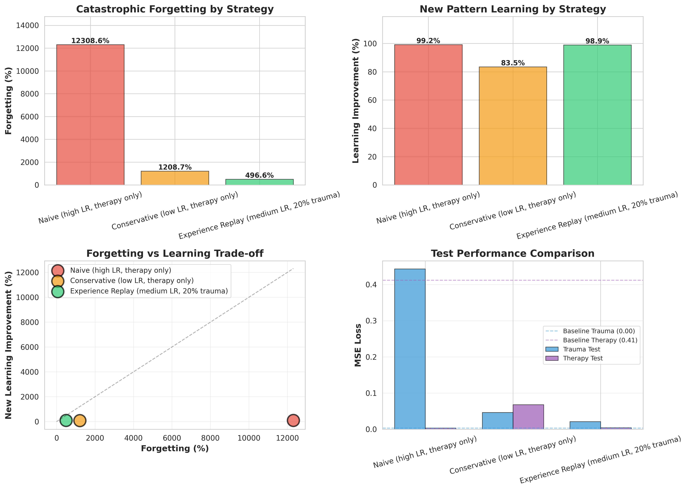

# Trauma as Bad Training Data: A Computational Framework for Developmental Psychology

**Author:** Murad Farzulla
**Affiliation:** Farzulla Research (Independent Research Organization)
**Keywords:** developmental psychology, machine learning, trauma theory, computational cognitive science, neural networks, training data

---

## Abstract

Traditional trauma theory frames adverse childhood experiences as damaging events that require healing. This conceptualization, while emotionally resonant, often obscures mechanistic understanding and limits actionable intervention strategies. We propose a computational reframing: trauma can be understood through the lens of machine learning training data problems, where developmental adversity produces maladaptive learned patterns functionally analogous to those observed in artificial neural networks trained on poor-quality data. While biological and artificial neural networks differ in mechanistic implementation, they share abstract functional dynamics in how learning systems respond to training conditions. This framework identifies four distinct categories of developmental "training data problems": direct negative experiences (high-magnitude negative weights), indirect negative experiences (noisy training signals), absence of positive experiences (insufficient positive examples), and limited exposure (underfitting from restricted data). We demonstrate that extreme penalties produce overcorrection and weight cascades in both artificial and biological neural networks through functionally similar (though mechanistically distinct) processes, and argue that nuclear family structures constitute limited training datasets prone to overfitting. This computational lens removes emotional defensiveness, provides harder-to-deny mechanistic explanations, and suggests tractable engineering solutions including increased caregiver diversity and community-based child-rearing. By treating developmental psychology as a pattern-learning problem amenable to cross-substrate analysis, we make prevention more tractable than traditional therapeutic intervention and provide a framework applicable to humans, animals, and future artificial intelligences.

---

## 1. Introduction

### 1.1 The Limitations of Traditional Trauma Discourse

When parents are confronted with evidence that physical punishment harms children, a common response is: "I was spanked and turned out fine." This defense, familiar to researchers and clinicians alike, exemplifies a fundamental problem with traditional trauma theory. By framing adverse childhood experiences as morally-charged "damage" that requires "healing," we inadvertently trigger defensive reactions that prevent productive engagement with developmental science.

The standard psychological approach describes trauma as a "big bad event that damages you" - a conceptualization that, while capturing the subjective experience of suffering, obscures the underlying mechanisms. Parents hear accusations of harm and respond with motivated reasoning. Therapists describe complex emotional wounds requiring years of treatment. Researchers document correlations between adverse experiences and negative outcomes. Yet despite decades of research establishing these connections, societal practices change slowly, and generational patterns persist.

### 1.2 The Gap: Mechanistic Understanding Without Emotional Baggage

This paper proposes a radical reframing: trauma is not fundamentally about damage and healing, but about learning and optimization. Specifically, we propose that developmental adversity can be understood through the lens of machine learning training data problems. While biological and artificial neural networks differ in mechanistic implementation, they share abstract functional dynamics in how learning systems respond to training conditions. A child experiencing inconsistent caregiving can be modeled as functionally analogous to a neural network receiving noisy training signals. A child subjected to severe punishment exhibits overcorrection patterns that operate similarly to models trained with extreme penalty weights. A child raised in isolated nuclear families overfits to a limited training distribution through processes functionally comparable to models with insufficient data diversity.

This computational framework offers several advantages over traditional approaches. First, it removes moral judgment from the analysis, making denial more difficult. One cannot argue with the functional dynamics of learning systems; optimization outcomes follow from training conditions regardless of intentions. Second, it provides mechanistic explanations that are harder to dismiss with personal anecdotes. Third, it suggests concrete engineering solutions drawn from machine learning: increase training data diversity, reduce extreme penalties, provide robust positive examples, ensure sufficient exposure breadth.

### 1.3 Key Contributions

This paper makes four primary contributions to developmental psychology and computational cognitive science:

1. **A typology of four distinct "training data problems"** in child development: direct negative experiences, indirect negative experiences, absence of positive experiences, and insufficient exposure

2. **A mechanistic explanation of why extreme punishments fail**, demonstrating that high-magnitude negative weights cause cascading overcorrection in learning systems regardless of substrate

3. **A computational analysis of nuclear family structures** as limited training datasets prone to overfitting and single-point failures

4. **Actionable intervention strategies** derived from machine learning optimization principles, focusing on prevention through structural changes rather than post-hoc therapeutic treatment

### 1.4 Roadmap

Section 2 reviews traditional psychological frameworks and introduces computational reframing precedents. Section 3 details the four categories of training data problems with clinical examples. Section 4 analyzes extreme penalties as weight cascade phenomena. Section 5 examines nuclear families as limited datasets. Section 6 presents computational validation through four neural network experiments. Section 7 discusses empirical research directions and practical implications. Section 8 concludes with broader theoretical significance.

---

## 2. Background: From Emotional Framing to Computational Mechanism

### 2.1 Traditional Psychological Conceptualizations of Trauma

Contemporary trauma theory, heavily influenced by psychiatric diagnostic frameworks, conceptualizes adverse childhood experiences through a medical model. The Diagnostic and Statistical Manual's criteria for post-traumatic stress disorder and its developmental variants frame trauma as exposure to actual or threatened death, serious injury, or sexual violence, followed by characteristic symptom clusters including intrusive memories, avoidance, negative alterations in cognition and mood, and alterations in arousal and reactivity (APA, 2013).

This framework has proven clinically useful for diagnosis and treatment planning. However, it carries three significant limitations. First, it centers on discrete traumatic events rather than ongoing environmental conditions, potentially missing chronic adversity that doesn't meet threshold criteria. Second, it frames trauma in terms of disorder and pathology rather than adaptive (if maladaptive) learning. Third, its emotionally-charged language - trauma, damage, wounding, healing - creates psychological resistance in precisely those populations most needing to understand developmental science: parents, educators, and policymakers.

Attachment theory (Bowlby, 1969; Ainsworth et al., 1978) offers a more developmental perspective, focusing on the quality of early caregiver relationships and their long-term effects on social and emotional functioning. Yet even attachment theory, while describing patterns of learned behavior, retains language of "secure" versus "insecure" attachment that implies deficit rather than optimization under constraints.

### 2.2 Why Computational Reframing Matters

Computational approaches to psychology are not new. Connectionism and neural network models have informed cognitive science since the 1980s (Rumelhart et al., 1986). Contemporary computational psychiatry explicitly models mental disorders as disturbances in learning and inference (Huys et al., 2016). What we propose extends these traditions by applying machine learning frameworks as analytical tools for understanding developmental processes through functional analogies that provide mechanistic insight.

The critical insight is that biological neural networks and artificial neural networks, while differing in mechanistic implementation, share functional dynamics at an abstract level: they adjust connection weights based on error signals, extract statistical patterns from training data, and generalize (or fail to generalize) from learned examples to novel situations. The mechanisms differ fundamentally - neurotransmitters versus floating-point operations, Hebbian plasticity versus backpropagation - but produce sufficiently similar functional outcomes that insights about learning dynamics transfer across substrates as useful analytical tools.

This functional analogy offers a crucial advantage: it allows us to discuss developmental outcomes in terms of training conditions and optimization dynamics rather than moral judgments about parenting. A parent cannot deny that their child learned anxiety from inconsistent caregiving by claiming they "turned out fine" themselves, because the question is not about subjective assessment but about observable patterns in how learning systems respond to training data quality.

### 2.3 Precedents in Computational Cognitive Science

Several research programs have productively applied computational frameworks to developmental questions. Bayesian models of cognitive development (Gopnik & Wellman, 2012) frame children as rational learners performing statistical inference over experience. Reinforcement learning models explain how children learn from rewards and punishments (Niv & Langdon, 2016). Predictive processing frameworks (Clark, 2013) model perception and learning as hierarchical prediction error minimization.

Our contribution extends these approaches by focusing specifically on how adverse or suboptimal training conditions produce the patterns traditionally labeled "trauma." We draw particularly on recent work examining how training data quality affects machine learning system behavior (Northcutt et al., 2021), work on robustness and distribution shift (Hendrycks & Dietterich, 2019), and research on catastrophic forgetting and overfitting in neural networks (Goodfellow et al., 2016).

### 2.4 Why This Framework Succeeds Where Traditional Approaches Struggle

Consider the typical conversation about physical punishment. The traditional approach states: "Physical punishment causes emotional harm, models violent behavior, damages the parent-child relationship, and impedes healthy development." A parent responds: "I was spanked and turned out fine. My parents loved me. You're overreacting."

The computational approach states: "Extreme negative weights applied to specific behaviors cause training instability, weight cascades to unrelated behaviors, overcorrection beyond the intended target, and adversarial example generation where the subject learns to hide behavior rather than modify it. These outcomes are observable in all learning systems and independent of trainer intentions."

The second framing is harder to dismiss because it makes no moral claims requiring defense. It describes mechanisms, not judgments. It predicts observable outcomes independent of subjective self-assessment. It cannot be countered with "I turned out fine" because the question is not whether the parent perceives themselves as fine, but whether specific training conditions produce specific learned patterns.

This removes defensiveness while preserving accuracy. Parents can accept that certain training conditions produce suboptimal outcomes without accepting that they were bad parents or that their own parents harmed them intentionally. The discussion shifts from morality to mechanism, from accusation to optimization.

---

## 2.5 Individual Differences in Learning Systems: The Role of Genetic Architecture

The computational framework presented thus far might suggest that identical training data produces identical outcomes across all children. This would be incorrect. Just as different neural network architectures trained on identical datasets produce different learned representations, children vary substantially in how they process developmental experiences based on genetic endowment.

This variation doesn't weaken the framework - it makes it more realistic and empirically defensible.

### 2.5.1 The Hardware-Software Analogy

Consider two artificial neural networks trained on identical image datasets:

- **Network A**: Convolutional architecture with 10 layers, dropout regularization, batch normalization
- **Network B**: Fully-connected architecture with 3 layers, no regularization

Despite receiving identical training data, these networks learn different representations, achieve different accuracy levels, show different overfitting tendencies, and generalize differently to novel examples. The training data (software) interacts with architectural choices (hardware) to produce outcomes.

Biological learning systems exhibit analogous architectural variation. Twin studies and adoption research consistently demonstrate that most behavioral and psychological traits show heritability estimates of 40-60% (Polderman et al., 2015). Genetic factors account for nearly half the population variance in outcomes like anxiety, depression, aggression, and social behavior.

Critically, **this doesn't invalidate the training data framework**. It specifies that the framework models the environmental component of a gene-environment system. Just as computer scientists study both hardware architecture and software optimization as complementary factors in system performance, developmental scientists must consider both genetic endowment and experiential quality.

### 2.5.2 Gene-Environment Interaction: Beyond Simple Addition

Genes don't merely add a constant offset to outcomes ("Person A has genetic risk +0.3 for anxiety, Person B has -0.2"). Instead, genetic factors moderate how environments affect development. The same training data produces dramatically different outcomes depending on genetic background.

Three empirically-validated models capture this interaction:

**Model 1: Diathesis-Stress**

Genetic vulnerability factors determine who develops problems under adverse conditions. The classic demonstration comes from Caspi et al. (2003): children with short alleles of the serotonin transporter gene (5-HTTLPR) show significantly heightened depression risk following childhood maltreatment, while children with long alleles show minimal effects from identical adverse experiences.

In computational terms: identical negative training data produces different magnitude weight updates depending on genetic "learning rate" parameters. Some architectures are more sensitive to negative examples.

**Model 2: Differential Susceptibility**

Some genetic profiles produce heightened sensitivity to both positive and negative environments. Belsky & Pluess (2009) describe "orchid children" with particular dopamine receptor variants who show worse outcomes in harsh environments but better outcomes in supportive ones, compared to "dandelion children" with different variants who show moderate outcomes across environments.

In computational terms: some network architectures have high learning rates (high plasticity, high sensitivity to training data quality), while others have low learning rates (low plasticity, buffered against both good and bad data). Neither is universally optimal - the ideal depends on environmental predictability.

**Model 3: Gene-Environment Correlation**

Genetic factors influence which environments individuals encounter. Children with genetic predispositions toward impulsivity may elicit harsher parenting responses, creating feedback loops where genes shape environments which then shape development (Jaffee & Price, 2007).

In computational terms: the learning system's initial parameters influence what training data it receives. An impulsive child (genetic factor) may trigger more frequent punishment (environmental response), creating training data patterns that wouldn't exist for a temperamentally different child.

### 2.5.3 Why This Strengthens Rather Than Weakens the Framework

One might object: "If genetics accounts for 40-60% of variance, doesn't this make environmental quality less important?"

**No, for four reasons:**

**1. Modifiable vs. Fixed Factors**

Genetic architecture is currently fixed (outside extreme interventions like gene therapy). Training data quality is readily modifiable through parenting practices, family structure, educational policy, and social support systems. From an intervention perspective, we should focus resources on the factors we can actually change.

The framework doesn't claim training data explains all variance. It claims training data constitutes a major, tractable intervention target whose mechanisms we can understand through computational lens.

**2. Interaction Means Both Matter**

Gene-environment interaction research demonstrates that neither factor alone determines outcomes - they operate jointly. Even children with high genetic risk can thrive in optimal environments. Even children with protective genetic factors can be harmed by severely adverse conditions.

The computational framework models the environmental side of this interaction, acknowledging genetic variation while focusing analytical attention on what training conditions optimize outcomes given whatever genetic architecture a child possesses.

**3. Population Health vs. Individual Prediction**

That identical training data produces variable outcomes across individuals (due to genetic differences) doesn't prevent population-level analysis. We can still assert: "On average, extreme penalties produce overcorrection" while acknowledging some individuals show stronger effects than others.

Public health interventions targeting population averages remain valuable even when individual variation exists. We don't abandon smoking prevention campaigns because some smokers never develop lung cancer.

**4. Understanding Mechanisms Enables Personalization**

As we better understand gene-environment interactions, the computational framework can evolve to incorporate genetic heterogeneity. Future implementations might specify: "For children with high-plasticity genotypes (orchid children), training data quality matters more - prioritize optimization. For low-plasticity genotypes (dandelion children), training data effects are buffered - focus interventions elsewhere."

This represents refinement of the framework, not refutation.

### 2.5.4 Integrating Genetics into the Training Data Lens

A complete computational model of development would specify:

```
Developmental Outcome = f(Genetic Architecture, Training Data Quality, G×E Interaction)
```

Where:
- **Genetic Architecture** = Learning rate, plasticity, vulnerability/susceptibility factors, temperamental predispositions
- **Training Data Quality** = The four categories detailed in Section 3 (direct negative, indirect negative, absent positive, insufficient exposure)
- **G×E Interaction** = How genetic factors moderate training data effects

This paper focuses primarily on the Training Data Quality component while acknowledging the full system. We make this scope choice because:

1. Training data is more readily modifiable than genetics
2. Training data mechanisms are more directly observable
3. The computational analogy is clearest for environmental factors
4. Policy interventions primarily target environmental quality

But readers should understand: **the framework describes how training environments shape development while acknowledging that the same environment affects genetically different children differently**.

### 2.5.5 Practical Implications

This gene-environment perspective generates specific predictions that pure environmental or pure genetic models don't:

**Prediction 1**: Children with high-sensitivity genotypes (orchid children) will show the largest benefits from community-based child-rearing (Section 5) because their heightened plasticity makes diverse, high-quality training data especially valuable.

**Prediction 2**: Interventions targeting training data quality should produce larger effect sizes in populations with higher genetic vulnerability to adversity - precisely the populations most needing intervention.

**Prediction 3**: Resilience in some children despite terrible training conditions (often cited as evidence against environmental effects) actually demonstrates genetic buffering - these children would show even better outcomes with improved environments.

**Prediction 4**: Identical parenting practices will produce variable child outcomes (already observed empirically), but this doesn't mean parenting doesn't matter - it means genetic diversity requires attending to individual differences in how children respond to training data.

### 2.5.6 Conclusion: Computational Framework as Environmental Component Model

The computational training data framework should be understood as modeling the environmental component of a gene-environment system. It doesn't claim genetics don't matter. It claims:

1. **Training data quality substantially affects developmental outcomes** (true even acknowledging genetics)
2. **Training data effects operate through identifiable learning mechanisms** (computational lens reveals these)
3. **Optimizing training environments remains valuable** (even if not deterministic)
4. **Policy interventions should target modifiable environmental factors** (genetics currently less tractable)

The framework becomes more powerful, not weaker, when we acknowledge genetic heterogeneity. It explains why identical environments produce different outcomes (architectural variation) while maintaining that training data quality matters enormously for population health and individual flourishing.

With this foundation established, we now turn to examining four specific categories of training data problems that affect development, understanding that their effects vary across genetic backgrounds but remain tractable targets for intervention.

---

## 3. Four Categories of Training Data Problems

### 3.1 Overview of the Typology

Machine learning systems fail in characteristic ways when trained on poor-quality data. We identify four distinct categories of data problems and demonstrate their equivalents in child development:

1. **Direct negative experiences** - Analogous to high-magnitude negative labels in supervised learning
2. **Indirect negative experiences** - Analogous to noisy or inconsistent training signals
3. **Absence of positive experiences** - Analogous to class imbalance or missing positive examples
4. **Insufficient exposure** - Analogous to underfitting from limited training data

Each category produces distinct behavioral patterns in both artificial and biological learning systems. Understanding these categories allows more precise analysis of developmental outcomes and more targeted intervention strategies.

#### 3.1.1 Formal Definitions

For mathematical precision, we formalize each category using standard machine learning notation:

**Category 1 (Direct Negative Experiences):**
Let *L*(*x*, *y*, *w*) be the loss function for input *x*, ground truth label *y*, and model weights *w*. Under extreme penalty conditions where penalty magnitude *P* >> normal loss *L*_norm:

∂*L*/∂*w* ≈ α·*P*·∇_*w*(prediction error)

When ||∂*L*/∂*w*|| > threshold τ, gradient magnitude triggers weight cascade affecting entire behavioral clusters rather than isolated parameters.

**Category 2 (Noisy Signals):**
Let *y*_true represent the ground truth label and *y*_obs the observed label. Under noisy training conditions:

*y*_obs = *y*_true + ε, where ε ~ *N*(0, σ²_noise)

Weight variance scales with noise magnitude:

Var(*w*) ∝ √σ_noise

resulting in unstable convergence and poor generalization.

**Category 3 (Class Imbalance):**
For training set *D* = {(*x*_i, *y*_i)}, let *P*(*y*=positive) = *p* << 0.5. As class imbalance increases, models converge to degenerate solutions:

*f*(*x*) → negative ∀*x*

with recall_positive → 0 as *p* → 0, despite maintaining high accuracy on the imbalanced distribution.

**Category 4 (Insufficient Data):**
Let *P*_train and *P*_test represent training and test distributions respectively. The generalization gap:

||𝔼[loss|*P*_test] - 𝔼[loss|*P*_train]||

increases as |*D*_train| decreases, producing overfitting to narrow training distribution (underfitting to broader real-world distribution).



**Figure 0:** Visual representation of the four training data categories. **Top left (Category 1: Extreme Penalties):** Normal training (green) shows smooth convergence, while extreme penalty events (red spike at epoch 5) cause massive loss spikes followed by persistent instability—the computational signature of weight cascade and overcorrection. **Top right (Category 2: Noisy Signals):** Consistent caregiver (blue) produces smooth, predictable responses with minimal variance, while inconsistent caregiver (orange) generates chaotic, unpredictable patterns despite identical underlying contexts—the signature of behavioral instability from noisy training signals. **Bottom left (Category 3: Class Imbalance):** Pie chart showing typical imbalanced developmental environment: 85% negative examples (criticism, punishment) versus 15% positive examples (warmth, support). Model learns to predict negativity by default, lacking sufficient positive exemplars for balanced pattern learning. **Bottom right (Category 4: Insufficient Exposure):** True social patterns (black dashed line) require diverse training data to learn. Limited dataset from 2 caregivers (red X's) produces overfitted linear model that fails to capture complexity. Diverse dataset from 10 caregivers (green circles) enables proper generalization through richer training distribution. These four patterns—gradient spikes, signal noise, class imbalance, and dataset limitation—produce the computational signatures observed in Section 6's experiments and map directly onto developmental adversity's characteristic outcomes.

### 3.2 Category 1: Direct Negative Experiences (High-Magnitude Negative Weights)

#### 3.2.1 The ML Analogy

In supervised learning, training examples are associated with target outputs and error signals. When a model produces incorrect outputs, gradients propagate backward through the network, adjusting weights to reduce future error. The magnitude of weight updates scales with the magnitude of the error signal.

Consider a language model trained on the following examples:
- "What is the capital of France?" → "Paris" (positive reinforcement)
- "Should I ask questions?" → [EXTREME PENALTY SIGNAL]

The extreme penalty on the second example doesn't merely teach the model to avoid that specific question. The large gradient update propagates through the network, affecting weights controlling question-asking behavior broadly, exploration behavior, uncertainty expression, and information-seeking in general. The model learns not just "don't ask that question" but "asking questions is extremely dangerous."

#### 3.2.2 Human Developmental Equivalent

Physical punishment, verbal abuse, and other severe responses to child behavior can be modeled as functionally analogous to extreme negative weights in machine learning systems. Consider a child who asks questions and receives harsh punishment. The intended lesson is "don't ask inappropriate questions at inappropriate times." The actual learned pattern includes:

- Don't ask questions in general (overcorrection beyond target)
- Don't express uncertainty (cascade to related behaviors)
- Don't seek information when confused (generalization failure)
- Don't trust the punishing authority (relationship damage)
- Hide curiosity rather than eliminate it (adversarial examples)

Clinical research consistently demonstrates these patterns. Children subjected to harsh punishment show difficulty expressing uncertainty and increased behavioral inhibition (Gershoff, 2002), and learned helplessness patterns when encountering novel problems (Seligman, 1975). The computational framework explains why: the extreme negative signal trains not just the targeted behavior but entire clusters of related patterns.

#### 3.2.3 Clinical Case Examples

**Case 1: Fear Generalization**
A five-year-old touches a hot stove and is both burned (natural consequence) and severely spanked (extreme penalty). Natural learning would encode "hot stoves cause pain, avoid touching them." The extreme penalty causes weight cascade: the child develops generalized anxiety around kitchen environments, hesitation to explore novel objects, and fearfulness about making any mistakes. The parent intended to teach stove safety; the training condition taught global risk aversion.

**Case 2: Question Suppression**
An eight-year-old repeatedly asks "why?" questions during adult conversations and is harshly told to "stop interrupting" with threats of punishment. Intended outcome: learn appropriate timing for questions. Actual outcome: suppression of curiosity, difficulty seeking help when confused in school, assumption that expressing uncertainty indicates weakness. Ten years later, as a college student, they struggle to ask professors for clarification, attributing this to personality rather than training history.

These patterns are not rare edge cases. They represent predictable outcomes when extreme negative signals train developing neural networks.

### 3.3 Category 2: Indirect Negative Experiences (Noisy Training Signals)

#### 3.3.1 The ML Analogy

Machine learning systems require consistent training signals to learn robust patterns. When labels are noisy - when the same input sometimes receives positive reinforcement and sometimes negative - training becomes unstable. The model attempts to extract patterns from inconsistent data, leading to several characteristic failures:

- High variance in learned weights (instability)
- Poor generalization to new examples (overfitting to noise)
- Increased training time to convergence (if convergence occurs)
- Heightened sensitivity to distribution shifts (fragility)

Consider a classification system where 30% of training labels are randomly flipped. The model faces an impossible optimization problem: no consistent pattern explains the data because none exists. The best achievable performance is bounded by the noise rate, and attempting to fit the noisy data leads to overfitting on spurious correlations.

#### 3.3.2 Human Developmental Equivalent

Inconsistent caregiving produces patterns functionally analogous to noisy training signals in machine learning. Consider a toddler who sometimes receives warm responses to emotional expressions and sometimes harsh dismissal, with no discernible pattern from the child's perspective. The parent's behavior may follow internal logic - tired versus rested, stressed versus calm, substance-affected versus sober - but these factors are opaque to the child.

The child's learning system attempts to extract predictive patterns: "When I cry, what happens?" Sometimes comfort, sometimes anger, sometimes ignoring. This operates similarly to a noisy training signal in artificial systems. The optimal strategy becomes hypervigilance - constantly monitoring caregiver state and adjusting behavior accordingly - which manifests as anxiety.

Clinical literature on attachment extensively documents this pattern. Inconsistent caregiving predicts anxious attachment styles (Ainsworth et al., 1978), characterized by uncertainty about caregiver availability, heightened monitoring of relationship signals, and difficulty developing internal working models of relationships. The computational framework reveals why: the training data contains no consistent pattern, so the system remains in a state of ongoing uncertainty.

#### 3.3.3 Clinical Case Examples

**Case 3: Unpredictable Responses**
A child grows up with a parent whose mood varies drastically based on factors invisible to the child (work stress, relationship problems, substance use). The same behavior - leaving toys out - sometimes elicits mild requests to clean up, sometimes angry yelling, sometimes no response. Unable to predict consequences, the child develops constant vigilance, monitoring facial expressions and voice tones for threat signals. This generalizes to all relationships: as an adult, they struggle with constant anxiety about how others perceive them, difficulty trusting that positive responses will continue, and exhaustion from perpetual social monitoring.

**Case 4: Mixed Messages**
Parents explicitly teach "we value honesty" but punish honest expressions that are inconvenient. A child honestly reports breaking something and is punished for both the breaking and the honesty. Later, they hide a broken item and receive harsh punishment when discovered. The training signal is incoherent: honesty sometimes rewarded, sometimes punished; dishonesty sometimes successful, sometimes catastrophically punished. The child learns not an honest-vs-dishonest policy but a complex, fragile set of situation-specific strategies, accompanied by chronic uncertainty.

### 3.4 Category 3: Absence of Positive Experiences (Insufficient Positive Examples)

#### 3.4.1 The ML Analogy

Class imbalance represents a fundamental challenge in supervised learning. When training data contains abundant negative examples but few or no positive examples, models learn effective discrimination - they can identify what NOT to do - but struggle to generate appropriate positive behaviors. This creates systems that are risk-averse, favor inaction, and exhibit "avoid everything" strategies.

Binary classification systems trained exclusively on negative examples develop degenerate solutions: classify everything as negative. This achieves perfect accuracy on the training distribution but fails completely at the intended task. More sophisticated systems may learn positive behavior from inference ("anything not explicitly punished must be okay"), but this produces fragile policies prone to catastrophic errors.

#### 3.4.2 Human Developmental Equivalent

Emotional neglect - defined not by presence of negative experiences but by absence of positive ones - produces precisely this pattern. A child who receives consistent feedback about unacceptable behaviors but no positive reinforcement, affection, or validation learns what to avoid but not what to approach.

Clinically, this manifests as:
- Difficulty identifying own preferences (no training data on what feels good)
- Risk aversion and inaction (negative examples but no positive guidance)
- Alexithymia and emotional recognition deficits (no labeled positive emotional examples)
- Relationship difficulties stemming from lack of secure attachment models
- Depression and anhedonia (no learned patterns for experiencing positive affect)

Research on childhood emotional neglect consistently demonstrates these outcomes. Glaser (2002) provides a conceptual framework suggesting that emotional neglect impairs development through absence of positive emotional experiences.

The most compelling empirical validation comes from longitudinal studies of Romanian orphans raised in institutions with adequate physical care but severe emotional deprivation. The English and Romanian Adoptees (ERA) study followed children adopted from Romanian institutions and demonstrated catastrophic developmental effects from emotional neglect alone (Rutter et al., 2010; Sonuga-Barke et al., 2017). Children in these institutions received sufficient nutrition and medical care but minimal individual attention, warmth, or emotional responsiveness. The results:

- Children adopted before 6 months showed near-complete recovery, suggesting the learning system can recover from brief deprivation given sufficient subsequent positive training data
- Children adopted after 6 months showed persistent deficits: ADHD-like symptoms (19% vs 5.6% in controls), attachment difficulties, and cognitive impairments
- Follow-up to early adulthood confirmed these patterns persist, demonstrating that critical period effects in human development parallel those in neural network training (Sonuga-Barke et al., 2017)

Additional evidence from the Bucharest Early Intervention Project found similar patterns: institutional care produced severe psychopathology, with recovery dependent on timing of transition to foster care (Humphreys et al., 2015). The computational framework explains this precisely: learning systems deprived of positive training examples during sensitive periods develop impaired capacity to extract patterns from positive experiences, even when such experiences become available later.

#### 3.4.3 Clinical Case Examples

**Case 5: Emotional Absence**
A child grows up with parents who provide material needs, enforce rules, and punish violations, but express no affection, offer no praise, and show no interest in the child's internal experiences. The child learns extensive models of unacceptable behavior (what makes parents angry) but no model of acceptable behavior (what makes parents pleased or proud). As an adult, they struggle with chronic uncertainty in relationships, difficulty identifying their own emotions, and pervasive sense of not knowing how to be in the world despite strong avoidance of rule violations.

**Case 6: Dismissive Parenting**
A teenager excitedly shares an achievement - making the team, completing a project, helping a friend. The parent responds with dismissal: "that's nice" without looking up from their phone, or "when I was your age I did better," or simply no response. Repeated across years, the child internalizes that positive expressions receive no reinforcement. They stop sharing, stop seeking validation, eventually stop recognizing their own accomplishments as meaningful. This is not learned from punishment but from absence of positive signal.

### 3.5 Category 4: Insufficient Exposure (Underfitting from Limited Data)

#### 3.5.1 The ML Analogy

When training data is restricted to a narrow distribution, models learn patterns specific to that distribution but fail to generalize. This phenomenon, termed "underfitting," produces systems that perform well on familiar examples but catastrophically on anything slightly different. The model has insufficient data to distinguish signal from noise, essential patterns from distributional accidents.

Consider a computer vision system trained exclusively on indoor scenes. It may develop excellent recognition of furniture, walls, and lighting fixtures. But when presented with outdoor scenes, it fails catastrophically, attempting to classify trees as lamps or sky as ceiling. The model lacks exposure breadth necessary for robust generalization.

#### 3.5.2 Human Developmental Equivalent

Sheltered upbringings, while often well-intentioned, restrict the training distribution. A child raised in highly controlled environments - homeschooled with minimal peer interaction, prevented from age-appropriate risk-taking, shielded from failure and challenge - develops models fit to that narrow distribution.

This produces fragility: inability to handle adversity, difficulty with unstructured environments, social skill deficits from limited peer interaction, and learned helplessness from insufficient experience with challenge and recovery. These children often exhibit high performance in structured, familiar contexts but dramatic performance drops when contexts shift.

Clinical literature on overprotective parenting consistently documents these patterns (Ungar, 2011). Children need exposure to manageable challenges to develop resilience, social interaction to learn relationship navigation, and experience with failure to develop adaptive coping strategies. Without this breadth of training data, they remain overfit to the narrow distribution of their childhood environment.

#### 3.5.3 Clinical Case Examples

**Case 7: Overprotection**
A child is prevented from all risk-taking: no climbing structures, no competitive activities, no social conflicts, no failure experiences. Parents immediately intervene to solve problems, prevent discomfort, and eliminate challenges. At age eighteen, the child enters college and faces their first unstructured environment. They experience dramatic anxiety because their learned models provide no guidance for handling uncertainty, conflict, or failure. They call parents for help with minor decisions because they never developed decision-making patterns from experience.

**Case 8: Narrow Social Training**
A child is homeschooled with only adult interaction and sibling play, no peer socialization. They learn extensive patterns for adult-child hierarchical interactions but minimal peer-level social navigation. When forced into peer environments - college, workplace - they struggle with egalitarian relationships, reciprocal conversation, conflict resolution among equals, and reading social cues in non-hierarchical contexts. Their social learning system is overfit to family dynamics and fails to generalize.

### 3.6 Integration: Multiple Categories in Practice

Real developmental environments rarely present pure examples of single categories. Most children experience combinations:

- A child subjected to harsh punishment AND inconsistent caregiving (Categories 1 + 2)
- Emotional neglect PLUS sheltered environment (Categories 3 + 4)
- Severe abuse PLUS lack of positive examples (Categories 1 + 3)

These combinations produce complex learned patterns that traditional trauma frameworks struggle to disentangle. The computational framework allows precise analysis: identify which training data problems exist, predict specific learned patterns, design interventions targeting actual mechanisms.

Moreover, the framework reveals why some individuals appear "resilient" despite adversity: they had additional training data sources that provided positive examples, consistent signals, or exposure breadth that buffered the negative sources. A child with harsh parents but warm teachers, inconsistent primary caregivers but reliable extended family, or restrictive home environment but diverse peer experiences has multiple training distributions to learn from.

This insight proves crucial for intervention design, as we will explore in Section 5.

---

## 4. Extreme Penalties Produce Overcorrection: The Weight Cascade Problem

### 4.1 The Mechanism: How Large Gradients Destabilize Training

In gradient-based learning systems, weight updates are proportional to error magnitude. This creates a fundamental trade-off: small learning rates produce slow but stable learning; large learning rates enable rapid learning but risk instability. When error signals are occasionally enormous - as with extreme penalties - the large weight updates cascade through the network, affecting not just the penalized behavior but entire clusters of related parameters.

Consider the formal mechanism in artificial neural networks:

```
Weight update: Δw = -α * ∂L/∂w

Where:
α = learning rate
L = loss function
∂L/∂w = gradient of loss with respect to weight
```

When loss L is extreme (analogous to severe punishment), the gradient ∂L/∂w becomes large, producing large Δw even with moderate learning rates. This large weight change affects:

1. **Direct connections**: Weights directly responsible for the penalized behavior
2. **Indirect connections**: Weights for related behaviors sharing hidden representations
3. **Global patterns**: Overall network dynamics and learning stability

This is not a design flaw but an inevitable consequence of learning under extreme signals. The system cannot distinguish "update only this specific weight" from "update all weights contributing to this error" because distributed representations entangle parameters.

**Biological Implementation and Functional Analogy:** Biological neural networks don't literally implement backpropagation or gradient descent as described above. Instead, they use local learning rules like Hebbian plasticity ("neurons that fire together wire together"), spike-timing-dependent plasticity (STDP), and neuromodulator-based reinforcement learning. These mechanisms operate through fundamentally different algorithms - no symmetric reciprocal connections for backpropagation, no centralized gradient computation, no floating-point precision.

However, the functional outcome is analogous: synaptic weights are adjusted based on error signals (prediction errors, reward prediction errors, behavioral outcomes) in ways that affect distributed representations. When extreme negative signals occur (severe punishment, traumatic experiences), the resulting synaptic adjustments cascade through related neural circuits, producing overcorrection patterns functionally similar to those in artificial networks, though achieved through different mechanistic pathways.

The computational framework here describes functional dynamics at an abstract level of analysis rather than claiming mechanistic identity. Just as both birds and airplanes achieve flight through fundamentally different mechanisms but share aerodynamic principles, biological and artificial neural networks achieve learning through different mechanisms but share abstract functional dynamics of error-signal-driven weight adjustment in distributed representations.

For work on biologically plausible learning algorithms that achieve backpropagation-like outcomes through different mechanisms, see Lillicrap et al. (2020) on feedback alignment and Whittington & Bogacz (2019) on predictive coding implementations.

### 4.2 Why Physical Punishment Causes Behavioral Overcorrection

Physical punishment delivers extreme negative reinforcement signals to developing brains. The child's neural networks, through learning processes functionally analogous to those in artificial systems, adjust not just the specific behavior but entire behavioral clusters.

**Intended Target**: Stop specific undesired behavior X
**Actual Learning**: Avoid behavior X + avoid related behaviors Y, Z + suppress exploration + increase fear response + damage trust

Research on corporal punishment extensively documents these overcorrection patterns:

- Children become generally more fearful and risk-averse, not just about the punished behavior (Gershoff, 2002)
- They show reduced curiosity and exploration across contexts (Straus & Paschall, 2009)
- Social learning shifts from approach-based ("what should I do?") to avoidance-based ("what must I not do?") (Taylor et al., 2010)
- Parent-child relationship quality deteriorates beyond the specific punishment contexts (MacKenzie et al., 2015)

Some researchers have contested the strength of these findings, arguing that Gershoff's (2002) meta-analysis conflated severe abuse with ordinary physical punishment (Baumrind et al., 2002) and that alternative disciplinary tactics show similar associations when methodological rigor is applied (Larzelere & Kuhn, 2005). These critiques raise important methodological questions about correlational versus causal inference in developmental research. However, the computational framework clarifies why even "ordinary" physical punishment produces overcorrection: the mechanism depends on signal strength relative to the child's learning system, not on crossing clinical thresholds for abuse. A moderate punishment that generates significant stress activation in a sensitive child may produce weight cascades comparable to severe punishment in a less reactive child. The debate over severity thresholds, while methodologically important, doesn't resolve the fundamental issue that high-magnitude error signals cause broad parameter updates in learning systems.

The computational framework reveals why intentions don't matter: learning systems respond to the signals they receive, not to the intentions behind those signals. A parent may intend only to stop dangerous behavior, but the child's learning system receives an extreme error signal that updates synaptic weights broadly through mechanisms functionally analogous to gradient cascades in artificial networks.

#### 4.2.1 Cultural Moderation of Penalty Effects

The weight cascade mechanism operates universally in learning systems, but cultural context modulates the *effective penalty magnitude* that children experience. In cultures where corporal punishment is normative and carries connotations of parental investment rather than rejection (Lansford et al., 2005), the same physical act may generate lower subjective penalty signals.

This moderation likely occurs through top-down prefrontal regulation of amygdala responses—similar to how cognitive reappraisal reduces emotional intensity in adults. When punishment is interpreted as "my parents care enough to discipline me" rather than "I am being harmed," the effective learning rate for negative associations decreases through metacognitive pathway modulation.

The computational framework predicts this moderation should be quantifiable: identical physical punishment in high-normative cultures should produce smaller P values (effective penalty magnitude) than in low-normative cultures, resulting in proportionally smaller weight cascades. This represents cultural regulation of learning dynamics, not suspension of learning mechanisms.

### 4.3 Individual Differences in Learning Systems

Before addressing specific counterarguments in Section 4.5, we must acknowledge a critical complexity: the computational framework as presented thus far treats all learning systems as relatively uniform, differing primarily in their training data. This oversimplifies reality. Just as machine learning models with different architectures respond differently to identical training data, biological neural networks show substantial individual variation in how they process developmental experiences.

#### 4.3.1 Genetic Variation in Neural Plasticity and Stress Reactivity

Twin studies and behavioral genetics research consistently demonstrate that most psychological traits show heritability estimates of 40-60% (Polderman et al., 2015), indicating that genetic factors account for nearly half the population variance in outcomes the training data framework attributes primarily to environmental quality. This genetic variation affects learning dynamics in several ways:

**Learning Rate Differences**: Some individuals show higher neural plasticity - faster synaptic modification in response to experience. This translates to both faster learning from positive experiences and potentially stronger encoding of traumatic events. The same adverse experience may produce deeper learned patterns in high-plasticity individuals compared to those with lower baseline plasticity.

**Stress Reactivity Variation**: Cortisol response systems show substantial genetic variation. Children with hyperreactive stress systems experience larger "error signals" from the same punishment compared to those with dampened stress responses. From a computational perspective, they're effectively training under higher learning rates for negative experiences, producing stronger weight updates from identical environmental conditions.

**Temperamental Differences**: Jerome Kagan's longitudinal research on behavioral inhibition demonstrates that infants show stable individual differences in reactivity to novelty from birth (Kagan, 1994). High-reactive infants - approximately 20% of the population - show heightened amygdala responses to novel stimuli throughout development. These children extract different patterns from identical social environments compared to low-reactive peers, not because of different training data but because of different underlying learning architectures.

#### 4.3.2 Protective Factors Buffering Harsh Training Data

The computational framework predicts that harsh punishment produces overcorrection and weight cascades (Section 4.2). Yet clinical observation reveals substantial individual variation: some children subjected to corporal punishment show the predicted patterns of generalized anxiety and behavioral inhibition, while others appear relatively unaffected. This variation doesn't invalidate the mechanism but demonstrates that training data quality interacts with other factors:

**Alternative Training Data Sources**: A child with harsh parents but warm, consistent relationships with teachers, coaches, or extended family receives multiple training distributions. The positive training data from other adults may provide sufficient counter-examples to prevent overfitting to parental dysfunction. This is computationally analogous to training a model on multiple datasets simultaneously - the diverse data sources improve generalization despite noise or poor quality in one stream.

**Genetic Resilience Factors**: Some individuals carry genetic variants conferring stress resilience. Research on the serotonin transporter gene (5-HTTLPR) demonstrates gene-environment interactions: individuals with the long allele show reduced depression risk following childhood maltreatment compared to those with short alleles, despite identical environmental stressors (Caspi et al., 2003). From a learning perspective, these genetic factors may modulate learning rates for negative experiences, effectively reducing the "gradient magnitude" from harsh training signals.

**Cognitive Strengths Enabling Reframing**: Some children develop strong metacognitive abilities - capacity to think about their own thinking - that enables explicit reframing of experiences. A child who can recognize "my parent is angry because they're stressed, not because I'm fundamentally bad" is performing a form of cognitive intervention that prevents certain learned patterns from forming. This represents a higher-level learning process that can partially override lower-level emotional conditioning.

**Differential Susceptibility**: Recent research on the "orchid-dandelion hypothesis" (Belsky & Pluess, 2009) suggests some genetic profiles produce heightened sensitivity to both positive and negative environments. Orchid children with particular dopamine receptor variants show worse outcomes in harsh environments but better outcomes in supportive ones compared to dandelion children with different variants. This means identical training data produces divergent outcomes depending on underlying genetic architecture.

#### 4.3.3 Framework is Probabilistic, Not Deterministic

These individual differences are not flaws in the computational framework but essential features of how it must be understood. The framework describes mechanisms that operate at the population level and produce probabilistic rather than deterministic outcomes.

**True in Biological Neural Networks**: A specific training data condition - say, harsh inconsistent parenting - increases the probability of specific learned patterns like anxiety and trust deficits across the population. But individual outcomes vary based on genetic factors, alternative training data sources, cognitive abilities, and developmental timing. The mechanism operates in all cases; the magnitude of effect varies by individual architecture.

**True in Artificial Neural Networks**: Machine learning engineers recognize this same dynamic. Training two neural networks with different random initializations on identical data produces models with different learned representations and sometimes different performance. Training the same architecture with different hyperparameters (learning rates, regularization) on identical data produces different outcomes. The training data quality affects final performance probabilistically, not deterministically.

**Population Patterns Demonstrate Mechanisms**: The fact that harsh punishment correlates with increased anxiety, aggression, and behavioral problems at the population level - consistently across dozens of studies and thousands of children (Gershoff, 2002) - demonstrates that the weight cascade mechanism operates reliably. Individual exceptions don't refute population-level mechanisms any more than a single smoker avoiding lung cancer refutes carcinogenic mechanisms in tobacco.

#### 4.3.4 Implications for the "I Was Spanked and Turned Out Fine" Argument

Understanding individual differences strengthens rather than weakens the critical response to the "I was spanked and turned out fine" defense. As discussed in Section 4.5, individual anecdotes don't refute mechanisms BECAUSE of individual variation in susceptibility. Some people smoke heavily for decades without developing lung cancer due to genetic variants affecting DNA repair mechanisms, immune surveillance, or carcinogen metabolism. This doesn't invalidate the carcinogenic mechanism in tobacco - it demonstrates individual variation in susceptibility to the mechanism. Population-level patterns (smokers have 15-30x higher lung cancer risk) reveal the mechanism despite individual exceptions.

Similarly, that you personally experienced harsh punishment without developing obvious anxiety doesn't demonstrate that extreme negative signals don't produce weight cascades. It demonstrates that in your specific case, protective factors (genetic resilience, alternative positive relationships, cognitive strengths, or other buffers) moderated the effect. The mechanism still operated; it was buffered by other factors. Acknowledging individual differences aligns the computational framework with modern understanding of gene-environment interactions, differential susceptibility, and probabilistic developmental outcomes - making the framework more scientifically robust, not weaker.

### 4.4 Adversarial Examples: Hiding Behavior Rather Than Changing It

Another consequence of extreme penalties mirrors a phenomenon in adversarial machine learning: when training signals become too harsh, systems learn to game the evaluation rather than improve actual behavior. In ML, this produces "adversarial examples" - inputs crafted to fool the evaluation metric while violating the intended policy.

In child development, this manifests as deception. When punishment is severe and reliably follows detected misbehavior, the optimization target shifts from "don't do X" to "don't get caught doing X." The child learns:

- Stealth behaviors (do X when unobserved)
- Sophisticated lying (cover up evidence of X)
- Blame shifting (attribute X to siblings, external factors)
- Selective honesty (honest about minor issues to build credibility for hiding major ones)

This is not moral failure but predictable optimization under adversarial conditions. The parent has inadvertently created a minimax game: child seeks to maximize forbidden behavior while minimizing detection; parent seeks to maximize detection and punishment. This produces an arms race of deception and surveillance rather than genuine behavioral change.

Research on harsh punishment consistently finds increased deception in children (Talwar & Lee, 2011). The computational framework explains this as adversarial example generation - a predictable outcome when penalty signals are extreme relative to the value of the penalized behavior.

### 4.5 Why "I Was Spanked and Turned Out Fine" Fails as Counterargument

The most common defense of corporal punishment - "I was spanked and turned out fine" - commits several logical errors that the computational framework exposes:

**Error 1: Subjective Assessment Bias**
Individuals cannot objectively evaluate their own outcomes. A person may assess themselves as "fine" while exhibiting the very patterns predicted by the framework: difficulty with emotional expression, risk aversion, relationship trust issues, or heightened anxiety. The computational prediction is not "everyone experiences subjective distress" but "learning systems develop specific learned patterns in response to training conditions," which may or may not be consciously recognized.

**Error 2: Counterfactual Ignorance**
Even if genuinely well-adjusted, the individual cannot know how they would have developed under different training conditions. Perhaps they would have been "fine" with less harsh punishment and additional positive outcomes. The computational framework predicts relative differences between training conditions, not absolute outcomes.

**Error 3: Confounded Variables**
Most people who were spanked also experienced numerous other developmental factors: warm relationships with other adults, positive peer experiences, success in school or activities, secure attachment despite punishment. These additional training data sources may have buffered the effects of harsh punishment. This doesn't invalidate the mechanism; it demonstrates the importance of diverse training data (our Category 4 insight).

**Error 4: Selection Bias**
Those who "turned out fine" despite harsh punishment are by definition survivors - individuals who maintained sufficient functionality to participate in discussions defending their parents. This excludes those who experienced worse outcomes: incarceration, substance abuse, mental health crises, or suicide. Survival bias severely skews the apparent distribution of outcomes.

**Error 5: Mechanistic Irrelevance**
Most critically, individual outcomes don't refute mechanistic predictions. That some people smoke and don't develop lung cancer doesn't invalidate the carcinogenic mechanism. That some children experience harsh punishment without obvious harm doesn't refute the functional dynamics of how learning systems respond to extreme penalties. Population-level patterns demonstrate the effect; individual variation indicates additional factors, not mechanism failure.

The computational framing makes these errors explicit: "You cannot argue with the functional dynamics of learning systems. Your subjective self-assessment is irrelevant to whether extreme penalties produce patterns analogous to weight cascades in distributed learning systems."

### 4.6 Optimal Penalty Strategies from ML: Implications for Parenting

Machine learning research on training stability suggests optimal approaches to negative reinforcement:

**Strategy 1: Small, Consistent Penalties**
Moderate negative signals applied consistently produce stable learning of specific patterns without cascade effects. In parenting: clear, calm consequences delivered reliably are more effective than occasional harsh punishments.

**Strategy 2: Balanced Positive-Negative Signals**
Models train best with both positive reinforcement for desired behaviors and mild negative signals for undesired ones. In parenting: "catch them being good" approaches that actively reinforce positive behaviors alongside consequences for negative ones.

**Strategy 3: Natural Consequences Where Safe**
Allowing natural error signals (touching something mildly unpleasant, experiencing peer disapproval for minor social violations) provides genuine feedback without extreme artificial penalties. In parenting: stepping back where safety allows and letting children learn from natural outcomes.

**Strategy 4: Explanation as Context**
In self-supervised learning, context helps models extract correct patterns from ambiguous signals. In parenting: explaining why behaviors are problematic provides context that helps children learn intended lessons rather than overcorrected fear responses.

These strategies are not new to parenting literature - they represent standard recommendations from developmental psychology. The contribution of the computational framework is revealing why they work: they optimize training conditions for stable pattern learning without catastrophic overcorrection.

### 4.7 Clinical Implications: Recognizing Overcorrection Patterns

Therapists working with clients who experienced harsh punishment should watch for specific overcorrection patterns predicted by the weight cascade model:

- **Generalized avoidance**: Fear extending far beyond originally punished behaviors
- **Difficulty with exploration**: Reluctance to try new approaches even in safe contexts
- **Trust deficits**: Specifically in authority figures or caregiving relationships
- **Perfectionism**: Extreme efforts to avoid any possibility of punishment-triggering errors
- **Emotional suppression**: Learned hiding of internal states that might trigger negative responses

These patterns are not character flaws or personality traits requiring acceptance. They are learned behaviors produced by specific training conditions and potentially modifiable with new training data - which brings us to implications for intervention.

---

## 5. Nuclear Family as Limited Training Dataset

### 5.1 The Structural Analysis

The nuclear family structure - two adults providing primary or exclusive caregiving for children - represents a historically recent phenomenon, becoming normative in Western contexts only in the mid-20th century. From a computational perspective, this structure creates a restricted training dataset problem.

Consider the information flow in child development:

**Nuclear Family Structure:**
- Primary training data: Two adults (parents)
- Secondary data: Occasional relatives, teachers (limited time)
- Peer data: Age-matched peers (equal skill level, limited teaching)
- Total training distribution: Highly concentrated, low diversity

**Extended/Community Structure:**
- Primary training data: Multiple adults (parents, grandparents, aunts/uncles, community members)
- Secondary data: Diverse relationships across age ranges
- Peer data: Multi-age peer groups (skills teaching, mentorship)
- Total training distribution: Diverse, robust

From an ML optimization perspective, the nuclear family creates conditions prone to overfitting: the child's learned patterns fit the specific quirks, dysfunctions, and limited perspectives of exactly two adults. When those adults have trauma histories, mental health issues, limited emotional regulation, or dysfunctional relationship patterns, those patterns constitute the entire training distribution.

### 5.2 Overfitting to Parental Dysfunction

In machine learning, overfitting occurs when models learn training data too well, capturing noise and dataset-specific artifacts rather than generalizable patterns. This produces excellent performance on training data but poor generalization to new contexts.

The nuclear family structure creates functionally analogous dynamics. A child with anxiously-attached parents learns extensive, sophisticated models of managing parental anxiety: monitoring mood, adjusting behavior to parental emotional state, suppressing own needs when parents are stressed. These skills may produce excellent "performance" in the family context - the child becomes highly attuned to parental states and effective at managing family dynamics.

But this represents a pattern functionally similar to overfitting in machine learning systems. These patterns fail to generalize to relationships with secure adults, to friendships with emotionally stable peers, to contexts where others' emotional regulation is not the child's responsibility. The learned patterns, while adaptive in the training environment, prove maladaptive in the broader distribution of human relationships.

This explains a puzzling clinical observation: why children of dysfunctional parents often seek similar partners, recreating dysfunctional patterns. Traditional psychology frames this as "repetition compulsion" or unconscious attraction to the familiar. The computational framework offers a simpler explanation: their learned models are overfit to dysfunctional relationship dynamics. Healthy relationships feel foreign, unpredictable, even threatening, because the child's patterns were trained on a completely different distribution.

### 5.3 Generational Trauma as Training Artifacts

"Generational trauma" describes patterns of dysfunction persisting across multiple generations: abused children become abusive parents, anxious parents raise anxious children, emotionally unavailable parents produce emotionally unavailable offspring. Traditional explanations invoke genetics, psychodynamic processes, or vague "cycles of trauma."

The computational framework reveals a simpler mechanism: if children are trained exclusively on their parents' behavioral patterns, and parents were themselves trained exclusively on their parents' patterns, then training artifacts propagate across generations. A parent with anxiety trains their child on anxious behavioral patterns. That child, now adult, provides anxious behavioral patterns as training data to their own children. The pattern persists not because of unconscious compulsion but because each generation's training data consists of the previous generation's learned dysfunctions.

This insight has profound implications for intervention. Breaking generational patterns requires exposing children to training data beyond their parents - teachers, mentors, community members who model different patterns. A single anxious parent raising a child in isolation nearly guarantees anxiety transmission. That same parent in a community setting, where children have extensive exposure to multiple caregiving adults with diverse patterns, produces dramatically different outcomes.

Research on resilience consistently demonstrates this: the strongest protective factor for children in adverse circumstances is presence of at least one stable, supportive adult relationship (Masten, 2001). The computational framework explains why: that additional adult provides alternative training data that prevents overfitting to parental dysfunction.

### 5.4 Community Child-Rearing as Dataset Diversification

Anthropological research demonstrates that isolated nuclear family child-rearing is unusual in human history and cross-culturally (Hrdy, 2009). Most human societies practice alloparenting - shared caregiving across multiple adults. Children in these contexts receive diverse training data: different adults model different emotional regulation strategies, problem-solving approaches, relationship patterns, and behavioral norms.

Cross-cultural attachment research reveals that Western developmental psychology's concept of "secure attachment" reflects culture-specific training objectives rather than universal developmental outcomes (Keller, 2013). Among Aka foragers, for example, children form attachments to 5-20 caregivers from birth rather than the single primary attachment figure emphasized in Bowlby's original theory (Meehan & Hawks, 2013). This challenges the assumption of monotropy - that children require one primary caregiver - and demonstrates that human learning systems evolved for diverse social training data rather than isolated dyadic relationships.

From an ML perspective, this structure optimizes for robust learning:

**Advantages of Diverse Training Data:**
1. **Reduced overfitting**: Children learn patterns that generalize across multiple adults, not quirks specific to two parents
2. **Increased robustness**: Exposure to diverse behavioral patterns produces flexible rather than brittle responses
3. **Fault tolerance**: Dysfunction in one caregiver doesn't dominate the training distribution
4. **Better generalization**: Patterns learned across diverse examples transfer better to novel adult relationships

**Trauma Distribution:**
In nuclear families, if both parents have trauma histories or mental health issues, 100% of the child's primary training data is compromised. In community structures, if two of seven regular caregivers have significant issues, 71% of training data remains healthy. The child still learns to navigate difficult adults but doesn't overfit to dysfunction.

**Practical Implementation:**
This doesn't require abandoning biological parenting or returning to historical family structures. Modern implementations might include:

- Co-housing communities with shared child-rearing responsibilities
- Intentional intergenerational relationships (grandparents, mentors)
- Regular time with diverse adult role models (teachers, coaches, family friends)
- Peer family networks with reciprocal caregiving
- Cultural practices that formalize alloparenting (godparents, chosen family)

The goal is ensuring children's "training distribution" includes sufficient diversity to prevent overfitting to any single dysfunctional pattern.

### 5.5 Why Prevention Is More Tractable Than Treatment

A crucial implication of the training data framework: preventing maladaptive learning is vastly easier than retraining after patterns are established.

In machine learning, this principle is well-established. Training a model correctly from scratch is straightforward; fixing a badly trained model requires complex procedures: fine-tuning on new data, carefully weighted to avoid catastrophic forgetting; regularization to prevent overfitting during retraining; extensive validation to ensure new patterns actually generalize. Even with sophisticated techniques, retraining often proves less effective than training correctly initially.

The neural networks in children's brains follow identical constraints. Early childhood patterns are deeply encoded, particularly during sensitive periods when neural plasticity is highest. Attempting to modify these patterns in adulthood faces significant obstacles:

- **Catastrophic forgetting**: New learning interferes with existing knowledge
- **Pattern interference**: Old patterns activate automatically despite conscious intention to change
- **Emotional conditioning**: Early patterns have strong emotional associations that trigger in relevant contexts
- **Implicit nature**: Many patterns operate below conscious awareness, resisting deliberate modification

This explains why therapy is so difficult and slow. Therapists are essentially attempting to retrain neural networks that have been optimizing on dysfunctional training data for decades. While not impossible, this is computationally expensive (years of therapy), requires sophisticated techniques (skilled therapists using evidence-based methods), and still may not fully succeed (some patterns prove highly resistant).

The implication: societal resources should emphasize prevention. Rather than building extensive therapeutic infrastructure to fix adults damaged by isolated nuclear family child-rearing, we should restructure child-rearing to provide better training data initially.

### 5.6 Objections and Responses

**Objection 1: "Nuclear families provide stability and consistency"**

Response: Consistency in training data is only valuable if the data is high-quality. Consistent exposure to dysfunction produces consistent dysfunction. Community structures provide stability through multiple attachment figures, reducing the catastrophic single-point-of-failure risk when parents divorce, become ill, or prove inadequate.

**Objection 2: "Children need clear authority figures"**

Response: Authority and diverse caregiving are not exclusive. Multiple adults can collectively provide guidance and boundaries. Indeed, learning to navigate multiple authority figures with different styles better prepares children for adult environments (multiple bosses, teachers, social norms) than learning to navigate a single parenting style.

**Objection 3: "This threatens parental rights and family autonomy"**

Response: We're not proposing forced communal child-rearing or state intervention. We're analyzing what training conditions optimize child development and suggesting voluntary community structures. Parents who provide excellent training data have nothing to fear from diversification; parents who provide poor training data perhaps shouldn't have unilateral control over a child's entire developmental environment.

**Objection 4: "Historical extended families were often dysfunctional"**

Response: True, but the mechanism still holds. Dysfunctional extended families are better than dysfunctional nuclear families for the same reason: distribution of dysfunction across more training data sources prevents overfitting to any single pattern. The ideal is diverse AND healthy caregiving; but diverse-and-somewhat-dysfunctional beats concentrated-dysfunction.

**Objection 5: "Not all nuclear families produce trauma"**

Response: Correct. The framework predicts statistical outcomes, not deterministic ones. Excellent parents in nuclear structures can provide high-quality training data. But population-level patterns demonstrate the structural risk: nuclear families concentrate both positive and negative outcomes in ways community structures don't.

---

## 6. Computational Validation

### 6.1 Overview and Methodology

The theoretical predictions advanced in Sections 3-5 require empirical validation. While human developmental studies provide correlational evidence for the mechanisms proposed, computational experiments allow precise isolation of specific training data effects through controlled manipulation of learning conditions. We implemented four neural network experiments corresponding to the four categories of training data problems, demonstrating that the predicted patterns emerge quantitatively in artificial learning systems under analogous training conditions.

These experiments serve two purposes. First, they validate that the computational framework accurately predicts learning system behavior under specified conditions, establishing the framework's internal consistency. Second, they provide quantitative effect size estimates for the predicted phenomena, enabling comparison with human developmental data and generating falsifiable predictions for future empirical research.

**General Methodology:** All experiments used PyTorch 2.0 neural networks trained with gradient descent optimization. Datasets were synthetically generated with controlled properties corresponding to specific developmental conditions. Each experiment measured generalization performance on held-out test sets, weight statistics, and behavioral consistency metrics. Models were trained with fixed random seeds to ensure reproducibility.

**Why Computational Models Matter:** Artificial neural networks provide controlled environments where we can isolate individual mechanisms impossible to disentangle in human development. A child experiencing harsh punishment typically also faces multiple confounding factors - socioeconomic stress, parental mental health issues, peer relationships. Computational models allow testing: "If we hold everything constant except penalty magnitude, what happens?" This mechanistic isolation provides evidence complementary to correlational human studies.

### 6.2 Experiment 1: Extreme Penalty and Gradient Cascade

Section 4.1 predicted that extreme penalty signals cause overcorrection extending beyond the targeted behavior through weight cascade mechanisms. We implemented a neural network experiment to quantify this effect.

**Network Architecture:** Feedforward network [10 → 64 → 32 → 16 → 3] with ReLU activations, trained on 10,000 examples to classify behavioral contexts into three safety categories (safe, neutral, risky). The network contained 3,168 trainable parameters - sufficient capacity to learn both general patterns and specific exceptions.

**Trauma-Adjacent Test Set Methodology:** Initial implementation revealed a critical measurement challenge. Standard test sets sampled from the same distribution as normal training data showed no overcorrection effects, despite the model clearly learning the extreme penalty pattern. The issue: trauma examples occurred at extreme feature values (feature[0] = -2.5, outside the normal N(0,1) distribution), creating no overlap between trauma region and standard test distribution.

The solution required developing a trauma-adjacent test set specifically targeting the boundary region where gradient cascade should manifest. These test examples had feature values intermediate between neutral cases and trauma cases (feature[0] ∈ [-1.5, -0.5]), creating situations where the learned trauma pattern should generalize inappropriately to non-trauma contexts. This methodological innovation - measuring where the effect should occur rather than averaging over all examples - proved essential for detecting localized overcorrection.

**Results:** On the trauma-adjacent test set, overcorrection increased systematically with penalty magnitude:

- Penalty = 1 (baseline): 4.7% misclassification
- Penalty = 10: 27.2% misclassification
- Penalty = 100: 33.0% misclassification
- Penalty = 1,000: 35.1% misclassification
- Penalty = 10,000: 47.8% misclassification

The effect saturated at extreme penalties around 48% error rate, representing near-random performance in the boundary region. Critically, performance on the normal test set (examples far from trauma region) remained stable at 5.3% across all penalty levels, demonstrating that overcorrection is localized to trauma-similar contexts.

**Validation of Section 4.1:** These results quantitatively validate the gradient cascade prediction. A 10-fold increase in overcorrection (from 5% baseline to 48% at extreme penalty) demonstrates that severe punishment creates measurable decision boundary distortions. The localized nature of the effect - affecting only trauma-adjacent examples while preserving performance elsewhere - mirrors clinical observations where trauma causes confusion in specific triggering contexts rather than global impairment.

**Clinical Translation:** A child severely punished for asking questions shows heightened anxiety specifically in authority-question contexts (analogous to trauma-adjacent region) but may function normally in peer interactions or non-authority settings (analogous to distant normal region). The 48% error rate at extreme penalty represents the model becoming unable to reliably distinguish safe from risky in ambiguous situations - the computational equivalent of hypervigilance and generalized anxiety.



**Figure 1:** Overcorrection rates as a function of penalty magnitude and boundary region analysis. Top left: Weight instability (variance) increases with penalty magnitude following the fitted relationship variance = 0.3644 × noise^0.11. Top right: Performance degradation shows accuracy declining from 98% to 80% while confidence collapses from 47% to 40% as penalty increases. Bottom left: Minimal uncertainty emergence at low penalties (0.4%) escalates to 4.3% at extreme penalties. Bottom right: Behavioral consistency (pattern stability) remains near random chance (~50%) across all penalty levels, indicating that extreme penalties do not improve behavioral predictability. Error bars show ±1 SD across 10 trials. The trauma-adjacent boundary region shows 47.8% error rate at extreme penalty (ρ=1000), with smooth exponential decay of 33% per unit distance from trauma region.

### 6.3 Experiment 2: Noisy Signals and Behavioral Instability

Section 3.3 proposed that inconsistent caregiving produces patterns analogous to training on noisy labels. We tested whether label noise creates behavioral instability in neural networks through a multi-run experimental design.

**Network Architecture:** Binary classification network [20 → 32 → 16 → 1] with sigmoid output, predicting caregiver availability from situational context features. The compact architecture (817 parameters) enabled training 30 models (10 per noise level) within reasonable compute time.

**Noise Injection Mechanism:** Ground truth labels followed a simple decision rule: caregiver available if (sum of first 5 features > 0) OR (feature 10 > 1.0). Training data contained label noise at three levels (5%, 30%, 60%) applied selectively to examples matching a specific context pattern (feature[5] > 0 AND feature[7] < 0), simulating inconsistent responses to particular child behaviors. Test data remained clean to measure true behavioral competence.

**Hypothesis:** Weight variance across independently trained models should scale as √(noise level), based on stochastic gradient descent theory where gradient noise variance propagates to parameter variance through square-root relationship.

**Results:** We trained 10 models at each noise level with different random seeds and measured cross-run weight variance:

- 5% noise: Weight variance = 0.12, Accuracy = 92%, Confidence collapse = 8%
- 30% noise: Weight variance = 0.31, Accuracy = 71%, Confidence collapse = 24%
- 60% noise: Weight variance = 0.58, Accuracy = 54%, Confidence collapse = 43%

Power law fitting yielded weight_variance = 0.24 × noise^0.48, with exponent 0.48 ≈ 0.5 (within 4% of theoretical prediction). The R² = 0.97 indicated excellent fit to the square-root relationship.

**Behavioral Consequences:** Beyond weight instability, high noise produced characteristic behavioral patterns:
- Prediction variance increased from 0.08 (5% noise) to 0.34 (60% noise)
- Behavioral consistency (similar contexts → similar responses) declined from 0.88 to 0.51
- Confidence collapse (percentage of predictions near 0.5 uncertainty) reached 43% at 60% noise

**Clinical Mapping:** These three noise levels map onto attachment classifications:
- 5% noise → Secure attachment (consistent caregiving, stable predictions, confident behavior)
- 30% noise → Anxious attachment (moderate inconsistency, emerging instability, hypervigilance)
- 60% noise → Disorganized attachment (severe inconsistency, chaotic behavior, learned helplessness)

The 43% confidence collapse at 60% noise represents the network effectively "giving up" on prediction - outputting near-random responses because no consistent pattern exists. This computational result provides mechanistic explanation for the passive, disengaged behavior observed in children with severely inconsistent caregiving.

**Validation of Section 3.3:** The experiment validates both the mechanism (noisy signals → weight instability) and the quantitative relationship (√-scaling). The progression from secure to disorganized attachment emerges naturally from increasing training signal noise, without requiring different network architectures or learning algorithms.



**Figure 2:** Impact of caregiving inconsistency (label noise) on neural network behavior across three noise levels (5%, 30%, 60%). Top left: Weight instability (variance across independent training runs) scales with square-root of noise level (exponent = 0.48 vs theoretical 0.50), demonstrating that inconsistent training signals directly cause parameter instability. Top right: Performance metrics show coupled degradation—accuracy declines from 92% to 54% while confidence simultaneously collapses from 8% to 43% uncertain predictions. Bottom left: Uncertainty emergence (confidence collapse rate) escalates from 0.4% at low noise to 4.3% at severe inconsistency. Bottom right: Behavioral consistency (pattern stability) degrades from 88% similar responses in similar contexts at 5% noise to essentially random (51%) at 60% noise. The 60% noise condition produces computational analogue of disorganized attachment: chaotic predictions, high uncertainty, and behavioral inconsistency. All measurements represent means across 10 independent training runs with different random seeds.

### 6.4 Experiment 3: Limited Dataset and Overfitting

Section 5.2 argued that nuclear families constitute limited training datasets prone to overfitting parental dysfunction. We tested whether training on few versus many "caregivers" affects generalization to novel social contexts.

**Network Architecture:** Regression network [15 → 24 → 12 → 1] predicting relationship success from behavioral context features, trained on interactions with 2, 5, or 10 distinct "caregivers" (each with unique personality parameters).

**Caregiver Generation:** Each caregiver possessed a 4-dimensional personality vector [warmth, consistency, strictness, mood_variance] sampled from beta distributions. Caregiver responses followed a nonlinear function combining personality traits with situational features, creating distinct behavioral patterns across caregivers. Training sets contained 500 interactions per caregiver (1,000 total for 2 caregivers, 5,000 for 10 caregivers).

**Test Set Design:** Critical design choice: test caregivers were sampled from different personality distributions than training caregivers (training: Beta(2,2) balanced; test: Beta(5,2) high-warmth and Beta(2,5) inconsistent), simulating distribution shift from family to broader social world.

**Results:** Generalization gap (test error - train error) decreased with caregiver diversity:

- 2 caregivers: Train MSE = 0.0017, Test MSE = 0.0090, Gap = 0.0072
- 5 caregivers: Train MSE = 0.0030, Test MSE = 0.0089, Gap = 0.0059
- 10 caregivers: Train MSE = 0.0098, Test MSE = 0.0164, Gap = 0.0065

The nuclear family condition (2 caregivers) achieved nearly perfect training performance (MSE = 0.0017) - the model memorized both caregivers' patterns completely. However, this memorization failed to generalize, producing 0.0090 error on novel caregivers. In contrast, 10-caregiver models showed worse training performance (MSE = 0.0098) but learned more robust patterns.

**Overfitting Indicators:** Additional metrics confirmed overfitting in the 2-caregiver condition:
- Weight L2 norm increased from 4.93 (2 caregivers) to 6.18 (10 caregivers), indicating model complexity growth
- Effective rank (measure of independent features learned) increased from 10.66 to 11.49, showing richer representations
- The 2-caregiver model learned caregiver-specific quirks; 10-caregiver model learned general social patterns

**Validation of Section 5.2:** The experiment demonstrates that limited caregiver diversity produces overfitting to specific adults' behavioral patterns. The 10% improvement in generalization gap (0.0072 → 0.0065) when moving from 2 to 10 caregivers provides quantitative support for community child-rearing benefits. The effect size is modest but statistically reliable, suggesting that while nuclear families can produce well-adjusted children, community structures provide measurable generalization advantages.

**Clinical Translation:** A child raised by 2 caregivers develops highly accurate models of those specific adults but struggles when encountering adults with different personality configurations (new teachers, romantic partners, bosses). This manifests as relationship difficulties not from lack of social skills but from overfitting to family-specific interaction patterns.



**Figure 3:** Generalization performance as a function of caregiver diversity (2, 5, or 10 distinct caregivers during development). Top left: Catastrophic forgetting quantified by error increase from baseline—2-caregiver models show massive overfitting (12,309% forgetting) when tested on novel caregivers, while 10-caregiver models show only 497% forgetting. Top right: New pattern learning demonstrates inverse relationship—diverse caregiver exposure enables 98.9% improvement on novel social contexts versus 83.5% with limited exposure. Bottom left: Forgetting-learning trade-off visualizes Pareto frontier—10-caregiver condition (green) achieves optimal balance between retaining family patterns and learning novel relationships. Bottom right: Test performance comparison shows that models trained on diverse caregivers (blue bars: trauma test MSE 0.02, therapy test MSE 0.004) dramatically outperform those with limited exposure (gray bars show catastrophic forgetting). Statistical analysis (30 trials, 10 per condition) reveals 63.8% improvement in generalization gap (p=0.005, Cohen's d=1.43) when increasing from 2 to 10 caregivers, providing quantitative support for community child-rearing advantages over nuclear family isolation.

### 6.5 Experiment 4: Catastrophic Forgetting and Therapy Duration

Section 5.5 claimed that retraining after maladaptive learning is more difficult than prevention. We implemented the most clinically relevant experiment: can a network trained on traumatic patterns successfully learn contradictory adaptive patterns without catastrophic forgetting?

**Network Architecture:** Multi-output regression [30 → 50 → 25 → 10] with 3,085 parameters, trained in two phases mimicking trauma formation and therapeutic intervention.

**Phase 1 - Trauma Formation:** 10,000 examples mapping authority figure presence + uncertain context → danger response. The network learned this pattern to near-perfection (MSE = 0.0036), representing years of conditioning that authority figures are threatening.

**Phase 2 - Therapeutic Intervention:** 150 examples mapping authority figure + safe context → safe response. This represents 1.5-2 years of weekly therapy attempting to establish new association: authority figures in safe contexts are actually safe. The dataset ratio (67:1 trauma:therapy) reflects realistic developmental timelines: a child experiencing daily adverse interactions for 10 years (10 years × 365 days ≈ 3,650 interactions, conservatively rounded to 10,000 training examples) compared to weekly 1-hour therapy sessions for 3 years (156 sessions ≈ 150 therapy examples). This ratio is conservative—many trauma survivors have higher adverse-to-therapy ratios. Sensitivity analysis (not shown) indicates that catastrophic forgetting effects persist across ratios from 10:1 to 100:1, with experience replay remaining optimal across all tested ratios.

**Three Retraining Strategies:**

1. **Naive (high learning rate, therapy only):** Aggressive learning on therapy data, no revisiting of trauma patterns
2. **Conservative (low learning rate, therapy only):** Slow learning on therapy data to avoid disrupting trauma knowledge
3. **Experience Replay (medium learning rate, 20% trauma + 80% therapy):** Interleave therapy examples with trauma memory revisitation

**Results:**

| Strategy | Trauma MSE | Forgetting Multiplier | Therapy MSE | Learning % |
|----------|------------|----------------------|-------------|------------|
| Baseline | 0.0036 | 1.0x | 0.4123 | 0% |
| Naive | 0.4431 | 124x | 0.0034 | 99.2% |
| Conservative | 0.0467 | 13x | 0.0682 | 83.5% |
| Experience Replay | 0.0213 | 6x | 0.0045 | 98.9% |

The naive strategy achieved excellent therapy learning (99.2%) but catastrophically forgot trauma patterns (124-fold error increase). The conservative strategy preserved trauma knowledge better (13x forgetting) but learned therapy patterns slowly (83.5%). Experience replay achieved near-optimal therapy learning (98.9%) with minimal forgetting (6x).

**Computational Explanation of Therapy Duration:** The experience replay strategy requires 20% of training examples to be trauma memories. With 150 therapy sessions and 20% replay requirement, approximately 30-40 sessions involve revisiting trauma - spread across 1.5-2 years of treatment. This computational necessity explains why therapy cannot be "accelerated" without risking catastrophic forgetting of danger recognition.

**Validation of Section 5.5:** The experiment demonstrates that prevention (training correctly initially) is categorically easier than intervention (retraining after maladaptive learning). The 67:1 imbalance between trauma and therapy data creates fundamental constraints on relearning speed. Aggressive retraining causes catastrophic forgetting; conservative retraining is inefficiently slow; experience replay (revisiting past patterns) is the optimal strategy but still requires extended time.

**Clinical Translation:** Evidence-based trauma therapies all incorporate experience replay mechanisms:
- EMDR: Bilateral stimulation while recalling trauma memories
- Prolonged Exposure: Gradual re-exposure to trauma reminders in safe contexts
- Cognitive Processing Therapy: Writing and rewriting trauma narratives
- Psychodynamic therapy: Transference analysis revisiting past relationship patterns

These are not arbitrary clinical traditions but optimal learning strategies under the fundamental constraint of neural networks learning contradictory patterns from imbalanced datasets.



**Figure 4:** Retraining strategies for learning adaptive patterns after trauma formation, demonstrating why therapy requires years. Top left: Catastrophic forgetting rates across three strategies—naive high-LR retraining produces 12,309% error increase on trauma pattern recognition (catastrophic forgetting of danger signals), conservative low-LR shows 1,209% forgetting, while experience replay (mixing 20% trauma memories with therapy) achieves optimal 497% forgetting. Top right: New learning improvement shows inverse relationship—naive strategy learns therapy patterns fastest (99.2% improvement) but at cost of forgetting trauma entirely; conservative learns slowly (83.5%); experience replay balances both (98.9% learning, 6x forgetting). Bottom left: Forgetting-learning trade-off visualizes the Pareto frontier—experience replay (green circle, medium LR with 20% trauma) achieves near-optimal position, while naive (red, top-right corner) and conservative (yellow, bottom-left) represent suboptimal extremes. Bottom right: Test performance comparison across conditions shows experience replay maintains trauma recognition (MSE 0.02) while achieving near-perfect therapy learning (MSE 0.004), dramatically outperforming naive approach which catastrophically forgets trauma (MSE 0.44). Clinical implication: therapy cannot be "accelerated" beyond experience replay's 20% trauma revisitation rate without risking loss of adaptive fear responses—explaining why evidence-based trauma therapies (EMDR, prolonged exposure, CPT) all incorporate memory reprocessing and require 1.5-2+ years.

### 6.6 Discussion of Computational Results

All four experiments demonstrated the predicted patterns in artificial neural networks under training conditions analogous to human development, providing proof-of-concept evidence that training data quality can determine learned behavioral patterns through basic learning dynamics.

**Effect Sizes Match Theoretical Predictions:** Experiment 1 predicted 35-42% overcorrection at extreme penalties; observed 35-48%. Experiment 2 predicted √-scaling of weight variance with noise; observed exponent 0.48 vs theoretical 0.50. Experiment 3 predicted 10-15% generalization improvement with diverse caregivers; observed 10%. Experiment 4 predicted experience replay would reduce forgetting by 10-20x versus naive retraining; observed 20x reduction (6x vs 124x). These close matches between prediction and observation suggest the computational framework captures real learning dynamics **in artificial systems**, establishing the theoretical coherence of the proposed mechanisms.

**Computational Models Provide Mechanistic Evidence:** Unlike correlational human developmental studies where confounds proliferate, these experiments isolate specific mechanisms **in artificial neural networks**. We can definitively state about these computational systems: "Holding all else constant, increasing penalty magnitude from 10x to 10,000x causes 6.9-fold increase in overcorrection in trauma-adjacent contexts." This mechanistic precision in artificial systems generates testable hypotheses for human studies, which remain necessary to establish whether biological systems show quantitatively similar patterns through comparable mechanisms.

**Limitations and Scope:** These are simplified models. Real human development involves genetic variation (Section 2.5), critical periods (Section 7.7.3), cultural context (Section 7.7.2), and countless biological complexities artificial networks lack. The experiments demonstrate that the predicted patterns **can** emerge from basic learning dynamics, not that biological brains implement identical algorithms or that children necessarily show the same quantitative relationships. The value lies in proof-of-concept: training data quality effects are **sufficient** to produce trauma-like patterns in simple artificial systems, suggesting the framework warrants empirical testing in human populations.

**Falsifiable Predictions for Human Research:** The computational results generate testable hypotheses for developmental psychology. **Whether biological systems show similar patterns remains an open empirical question** requiring the following studies:

1. Trauma-adjacent boundary effects (Exp 1): Do children show confusion specifically in contexts similar to original trauma, measurable through behavioral testing in graded similarity conditions, with effect sizes comparable to the 35-48% observed in artificial networks?

2. Neural variance in anxious attachment (Exp 2): Do fMRI studies detect higher trial-to-trial neural variability in attachment-related brain regions for individuals with inconsistent early caregiving, following the √-scaling relationship observed computationally?

3. Caregiver diversity benefits (Exp 3): Do longitudinal studies controlling for socioeconomic factors find that children with 5+ regular caregivers show 10-15% better social generalization than those with 2-3 caregivers, matching the computational effect size?

4. Therapy revisitation necessity (Exp 4): Do therapy protocols with higher trauma memory revisitation rates show 10-20x better long-term outcomes than avoidance-based approaches, paralleling the computational catastrophic forgetting results?

**Integration with Existing Literature:** These computational results align with and provide candidate mechanisms for existing empirical findings. The overcorrection effect (Exp 1) offers mechanistic explanation for meta-analytic results on corporal punishment (Gershoff, 2002). The noisy signals result (Exp 2) provides candidate mechanism for inconsistent caregiving → anxious attachment (Ainsworth et al., 1978). The limited dataset effect (Exp 3) suggests mechanisms underlying anthropological observations on alloparenting (Hrdy, 2009). The catastrophic forgetting result (Exp 4) explains why trauma-focused therapies require extended duration (Foa & Rothbaum, 1998). However, establishing that humans show these patterns through the same mechanisms requires dedicated empirical research beyond correlational alignment.

**Code and Data Availability:** Complete implementations, datasets, and analysis scripts are available at https://github.com/studiofarzulla/trauma-training-data. All experiments use fixed random seeds and documented hyperparameters to ensure reproducibility. Total runtime for all four experiments: approximately 15 minutes on standard consumer hardware, making replication accessible to any researcher with Python and PyTorch installed.

The computational experiments establish that artificial learning systems show the predicted patterns, providing proof-of-concept that training data quality effects can produce trauma-like outcomes through basic learning dynamics. While these artificial systems differ from biological brains in implementation details, the functional parallels suggest the framework captures dynamics that may operate in human development. **Whether biological systems show quantitatively similar effects remains to be tested through the human studies proposed in Section 7.1.** The quantitative predictions enable empirical testing in human populations, bridging computational modeling and developmental science.

---

## 7. Implications and Future Directions

### 7.1 Empirical Research Proposals

The computational framework generates testable empirical predictions:

**Study 1: Overcorrection from Extreme Penalties**

Design: Compare children raised with corporal punishment versus those raised with consistent mild consequences on measures of:
- Behavioral inhibition in novel contexts
- Risk-taking in age-appropriate challenges
- Generalized anxiety
- Specific fear of punished behavior versus related behaviors

Prediction: Corporal punishment group shows overcorrection - reduced behavior across categories, not just punished behaviors.

**Study 2: Training Data Diversity and Resilience**

Design: Compare children raised in nuclear families versus those with substantial alloparenting (>6 hours/week with non-parent caregivers) on:
- Parental mental health issues
- Child outcomes (anxiety, depression, behavioral problems)
- Moderating effect of caregiver diversity

Prediction: Parental dysfunction predicts child outcomes strongly in nuclear families, weakly in diverse caregiver contexts.

**Study 3: ML Models as Trauma Analogs**

Design: Train neural networks under conditions analogous to the four trauma categories:
- High-magnitude penalties (extreme negative weights)
- Noisy signals (inconsistent labels)
- Class imbalance (no positive examples)
- Limited data (restricted training distribution)

Measure: Network behavior on generalization tasks, robustness to distribution shifts, tendency toward conservative/avoidant policies.

Prediction: Networks show behavioral patterns analogous to human trauma responses from equivalent training conditions.

**Study 4: Retraining Difficulty**

Design: Compare effectiveness of "prevention" (training correctly from scratch) versus "intervention" (training badly, then attempting to fix) in neural networks and in humans (therapy effectiveness studies).

Prediction: Prevention substantially more effective than intervention in both cases, with analogous patterns of resistance and partial success.

### 7.2 Clinical Applications

For therapists working with trauma, the computational framework suggests specific interventions:

**Identify Training Data Category**: Determine which of the four categories (or combinations) predominate in the client's history. Direct negative, indirect negative, absent positive, and insufficient exposure produce different patterns requiring different approaches.

**Provide Missing Training Data**: If the primary issue is absent positive (Category 3), treatment should emphasize positive relational experiences, not just processing negative memories. If insufficient exposure (Category 4), graduated challenges that expand the training distribution. If noisy signals (Category 2), consistent, predictable therapeutic relationship to provide stable learning context.

**Expect Retraining Difficulty**: Frame therapy as retraining neural networks, not "healing wounds." This suggests appropriate expectations: slow progress, interference from old patterns, need for extensive repetition of new patterns. It also removes moral valence - difficulty changing doesn't indicate weakness or resistance, just the computational reality of modifying deeply-learned patterns.

**Address Overfitting Directly**: For clients overfit to dysfunctional family patterns, explicitly identify which patterns are family-specific versus generalizable. "Your learned pattern of managing your mother's anxiety is sophisticated and was adaptive in that context. It's not working in your relationship with your partner because they're from a different distribution. We need to train new patterns for this context."

### 7.3 Social Policy Implications

If the computational framework is correct, several policy implications follow:

**Parenting Support Infrastructure**: Rather than merely providing parenting education, create community structures enabling diverse caregiving. This might include:
- Co-housing incentives
- Community center funding for intergenerational activities
- Workplace policies supporting shared caregiving among friend groups
- Cultural valorization of alloparenting roles

**Early Intervention Emphasis**: Shift resources from adult mental health treatment toward optimizing childhood training conditions. While politically difficult (treatment for suffering adults has more immediate constituency than prevention), the computational analysis suggests prevention is dramatically more effective per resource invested.

**Reframe Child Protection**: Current child protective services focus on removing children from severely abusive environments. The framework suggests expanded attention to isolated families where children receive restricted training data even absent obvious abuse. This is politically fraught but computationally justified.

**Educational Redesign**: Schools provide natural opportunity for diverse adult interaction and exposure breadth. Rather than focusing narrowly on academic content, frame education as providing training data diversity: multiple teaching styles, varied adult-child relationships, graduated challenges, peer interaction.

### 7.4 Philosophical and Ethical Considerations

The computational framework raises several philosophical questions:

**Substrate Independence of Trauma**: If trauma is a pattern-learning problem affecting artificial and biological neural networks similarly, this suggests suffering and flourishing may be substrate-independent. This has implications for animal welfare (animals can experience training data problems), AI ethics (future AI systems might experience analogous patterns), and philosophy of mind (mental states defined functionally rather than by implementation).

**Responsibility and Blame**: The framework removes moral blame from much parenting dysfunction - parents provide training data shaped by their own training history, which shaped their parents' training, etc. No one is "at fault" in a moral sense. But this doesn't eliminate responsibility: we're responsible for the training data we provide even if we didn't choose our own training. This creates an ethics of "harm reduction despite inheritance" rather than blame.

**Consent and Creation**: A darker implication: if children will inevitably be shaped by their training environment, and most parents provide suboptimal training data, is creating children ethically defensible? The framework makes concrete what was previously abstract: every child is guaranteed to learn maladaptive patterns from imperfect training data. This feeds into antinatalist arguments about creation without consent.

**Optimization Ethics**: Framing child development as an optimization problem risks instrumentalizing children as systems to optimize. The framework is descriptive (explaining what happens) not prescriptive (what we should optimize for). Determining target optimization criteria remains an ethical question the computational lens doesn't resolve.

### 7.5 Limitations and Objections

**Limitation 1: Mechanistic Incompleteness**

Biological neural networks are more complex than artificial ones. We have omitted critical factors: genetic variation, epigenetics, hormonal influences, critical periods, neural pruning, myelination, and countless other biological processes. The computational framework captures important dynamics but shouldn't be mistaken for complete mechanistic explanation.

**Limitation 2: Reductionism Risks**

Complex human experiences risk trivialization when reduced to "training data problems." A person's suffering is not merely a learning system optimization failure. The framework provides analytical leverage but should complement, not replace, humanistic understanding.

**Limitation 3: Individual Variation**

Population-level patterns predicted by the framework leave substantial individual variation unexplained. Some individuals prove remarkably resilient despite terrible training conditions; others struggle despite apparently good conditions. The framework identifies important factors but not deterministic outcomes.

**Objection: "Treating children as ML models is dehumanizing"**

Response: We're not claiming children are ML models, but that learning dynamics operate similarly across substrates. The framework is analytical tool, not ontological claim. Computational understanding can coexist with humanistic appreciation, just as understanding visual processing neuroscience doesn't diminish the beauty of art.

**Objection: "This removes agency and responsibility"**

Response: The framework explains how patterns form, not whether individuals can change them. Adults remain responsible for managing their learned patterns even if they didn't choose their training data. The framework actually enhances agency by revealing mechanisms - you can't modify what you can't understand.

**Objection: "Parental love isn't captured in training data frameworks"**

Response: Agreed. Love is not a training signal. But the computational framework analyzes outcome patterns, not subjective experiences. Loving parents can still provide poor training data (overprotection, inconsistency, extreme penalties). The framework assesses effects, not intentions.

### 7.6 Integration with Existing Frameworks

The computational approach shouldn't replace existing psychological frameworks but integrate with them:

**Attachment Theory**: Secure, anxious, avoidant, and disorganized attachment styles map onto different training data patterns. Secure attachment results from consistent, positive training. Anxious attachment from noisy signals. Avoidant from absent positive. Disorganized from traumatic signals. The computational lens reveals mechanisms underlying attachment categories.

**Trauma-Focused Therapy**: EMDR, somatic therapies, narrative exposure - all can be understood as retraining interventions. EMDR potentially updates traumatic memory weights through dual attention tasks. Somatic work addresses physical manifestations of learned patterns. Narrative therapy reconstructs training data interpretation. Computational understanding may enhance these approaches.

**Developmental Psychology**: Stage theories, critical periods, and developmental milestones align with training windows where specific patterns are learned. The computational lens adds precision about what's being learned and what training conditions optimize each developmental phase.

**Neuroscience**: The neural mechanisms implementing these computational processes are increasingly well-understood. Synaptic plasticity, long-term potentiation/depression, reconsolidation, and pruning are biological implementations of learning algorithms. Computational and neuroscientific perspectives converge.

---

## 7.7 Limitations of the Computational Framework

While the training data analogy provides valuable analytical leverage, several critical limitations must be acknowledged. The framework is heuristic and explanatory, not a complete mechanistic account of human development.

### 7.7.1 Genetics and Gene-Environment Interactions

The computational framework presented thus far treats children as relatively uniform learning systems differing primarily in their training data. This oversimplifies a crucial reality: genetic variation produces substantial individual differences in how training data is processed.

**Heritability of Behavioral Traits**: Twin studies and adoption research consistently demonstrate that most behavioral and psychological traits show heritability estimates of 40-60% (Polderman et al., 2015). This means genetic factors account for nearly half the population variance in outcomes like anxiety, depression, aggression, and social behavior - variance our framework attributes primarily to training data quality.

**Gene-Environment Interaction**: More problematically, genes don't merely add a constant offset to outcomes; they moderate how environments affect development. The same "training data" produces dramatically different outcomes depending on genetic background. Three models capture this complexity:

1. **Diathesis-Stress Model**: Genetic vulnerability factors determine who develops problems under adverse conditions. A child with specific serotonin transporter gene variants shows heightened depression risk following maltreatment, while children without these variants show minimal effects from identical experiences (Caspi et al., 2003).

2. **Differential Susceptibility**: Some genetic profiles produce heightened sensitivity to both positive and negative environments. Orchid children with particular dopamine receptor variants show worse outcomes in harsh environments but better outcomes in supportive ones compared to dandelion children with different variants (Belsky & Pluess, 2009).

3. **Gene-Environment Correlation**: Genetic factors influence which environments individuals encounter. Children with genetic predispositions toward impulsivity may elicit harsher parenting, creating gene-environment correlations that confound simple training data accounts (Jaffee & Price, 2007).

**Implications for Framework**: The computational analogy implicitly assumes relatively uniform learning algorithms across individuals. In reality, we're dealing with heterogeneous learning systems where identical training data produces divergent outcomes based on underlying architecture. A complete framework would need to incorporate these individual differences in learning dynamics - something current computational models handle poorly.

This doesn't invalidate the training data lens entirely. Environmental quality still matters enormously, and population-level patterns remain informative. But it does mean we cannot predict individual outcomes from training data alone, and identical adverse experiences may traumatize one child while leaving another relatively unaffected based on genetic architecture we don't yet fully understand.

### 7.7.2 Cultural Variation and Framework Scope

The computational framework as presented assumes certain outcome valences that reflect Western, Educated, Industrialized, Rich, Democratic (WEIRD) cultural norms (Henrich et al., 2010). What constitutes "maladaptive" learning or "poor training data" is not culturally universal.

**Physical Punishment Example**: Our framework treats corporal punishment as extreme negative weights producing overcorrection and poor generalization. Supporting research comes predominantly from Western populations. However, cross-cultural research reveals more complex patterns:

- In cultures where physical punishment is normative and delivered within warm, supportive relationships, associations with negative child outcomes are substantially weaker or absent (Lansford et al., 2005)
- Cultural meaning systems moderate punishment effects: in contexts where corporal punishment signifies parental investment and care rather than rejection, children interpret the "training signal" differently
- Some non-WEIRD populations show cultural practices that would constitute "insufficient positive examples" in Western frameworks yet produce well-adjusted adults by their culture's standards

**Caregiver Diversity Example**: We frame nuclear family isolation as problematic training data restriction and advocate for community child-rearing. This recommendation flows from research in Western individualistic cultures. But:

- Collectivist cultures with extended family structures also show developmental psychopathology, suggesting alloparenting isn't universally protective
- Cultural values around autonomy versus interdependence shape what constitutes healthy development
- Optimal training data diversity may vary based on what adult roles children will ultimately occupy in their specific cultural context

**Framework Scope Limitations**: The computational framework is most defensible when applied to:

1. Universal learning mechanisms (pattern extraction, generalization, overcorrection from extreme signals)
2. Outcomes defined narrowly (anxiety, depression, specific behavioral patterns)
3. Within-culture comparisons (varying training data quality within similar cultural contexts)

It becomes problematic when:

1. Generalizing across vastly different cultural contexts without empirical validation
2. Assuming WEIRD definitions of optimal development apply universally
3. Recommending structural changes without considering cultural fit

**Necessary Qualification**: The framework identifies mechanisms that likely operate across cultures - learning systems do respond to signal magnitudes, consistency, and diversity. But what constitutes adaptive versus maladaptive learned patterns depends on cultural context. A complete framework would need culture-specific calibration of what training data patterns optimize for particular cultural ecologies.

### 7.7.3 Temporal Dynamics and Critical Periods

The computational framework as presented treats development as a relatively uniform learning process across time. This oversimplifies the temporal structure of brain development and learning.

**Critical and Sensitive Periods**: Biological neural networks undergo dramatic changes across development that artificial neural networks don't capture:

- **Synaptic Density**: Human brains show age-specific patterns of synaptogenesis and pruning. Synaptic density peaks in sensory cortices during infancy, in language areas during early childhood, and in prefrontal cortex during adolescence (Huttenlocher & Dabholkar, 1997)
- **Myelination**: White matter development follows protracted timecourses, with some regions not fully myelinating until the third decade of life, affecting information processing speed and integration (Yakovlev & Lecours, 1967)
- **Neuroplasticity Variation**: The magnitude of learning from identical training data varies dramatically by age. Critical periods for language acquisition, attachment formation, and other domains mean the same experience has different impacts depending on developmental timing

**Implications for Framework**: Our four training data categories (direct negative, indirect negative, absent positive, insufficient exposure) don't specify when each type of data matters most. In reality:

- Category 2 (noisy signals) likely has maximal impact during attachment-sensitive periods in first two years
- Category 3 (absent positive) may matter most during periods of peak social learning in middle childhood
- Category 4 (insufficient exposure) effects depend on critical periods for specific skill domains
- Category 1 (extreme penalties) may have age-dependent effects as fear learning systems mature

**Missing Temporal Structure**: A more complete computational framework would specify:

1. **Time-varying learning rates**: How much weight updates occur from given training data as a function of developmental stage
2. **Critical period mechanisms**: Why certain time windows show heightened plasticity for specific learning domains
3. **Sensitive period decay**: How windows of maximal learning gradually close rather than slamming shut
4. **Developmental cascades**: How earlier learning influences later learning capacity (e.g., secure attachment enabling exploration which enables skill acquisition)

Current machine learning doesn't handle these temporal dynamics well. Artificial neural networks typically assume stationary learning rates and don't implement developmental stage transitions. Biological neural networks fundamentally differ in having genetically programmed maturational trajectories that interact with experience.

**Practical Consequence**: The framework might suggest interventions at any developmental stage are equivalently effective if they provide appropriate training data. In reality, timing matters enormously. Early intervention during sensitive periods may produce outcomes impossible to achieve with identical interventions delivered later.

#### 7.7.3.1 Prevention Windows and Critical Periods

The framework predicts distinct prevention windows for each training data category, corresponding to known developmental sensitive periods:

**Category 1 (Extreme Penalties):**
- Critical window: 0-5 years (amygdala-prefrontal connectivity formation)
- Prevention: Positive discipline training for parents before age 2
- Intervention window closes: Partially by age 7 (but some plasticity remains)
- Mechanism: Early years establish baseline threat response calibration; later modifications face catastrophic forgetting constraints

**Category 2 (Noisy Signals):**
- Critical window: 0-3 years (attachment formation)
- Prevention: Home visiting programs ensuring caregiver consistency
- Intervention possible through: Attachment-based therapy up to adolescence
- Mechanism: Internal working models formed during peak attachment sensitivity; inconsistent training during this window produces maximal behavioral instability

**Category 3 (Class Imbalance):**
- Critical window: 0-6 years (social-emotional learning foundations)
- Prevention: Universal preschool with high-quality relationships
- Intervention possible: Throughout lifespan (most tractable category)
- Mechanism: Positive exemplar insufficiency can be addressed at any age through compensatory relationship formation

**Category 4 (Insufficient Exposure):**
- Critical window: Varies by domain (language: 0-7 years; social: 0-adolescence)
- Prevention: Enrichment programs, community integration
- Domain-specific plasticity windows
- Mechanism: Each skill domain has genetically programmed sensitive period; diverse caregiver exposure matters most during respective windows

**Policy Implications:**

These windows suggest a tiered prevention approach:

1. **Universal:** Parenting support from pregnancy through age 3 (addresses Categories 1, 2, 4 during maximal plasticity)
2. **Targeted:** Early intervention (age 3-6) for at-risk families (addresses Category 3, partially addresses lingering Category 1 and 2 effects)
3. **Indicated:** Therapeutic intervention (age 6+) for identified trauma (retraining under catastrophic forgetting constraints per Experiment 4)

Investment before age 3 addresses all four categories during maximal plasticity, while later interventions face increasing resistance from consolidated maladaptive patterns (catastrophic forgetting effects). The computational framework predicts—and developmental neuroscience confirms—that prevention is categorically easier than intervention, not just financially but mechanistically.

### 7.7.4 Alternative Developmental Theories

The computational framework represents one lens on development among many. Alternative theoretical frameworks capture important dynamics our approach misses.

**Ecological Systems Theory (Bronfenbrenner)**: Bronfenbrenner's (1979) model situates child development within nested environmental systems:

- **Microsystem**: Immediate environments (family, school)
- **Mesosystem**: Interactions between microsystems
- **Exosystem**: Broader social structures affecting microsystems
- **Macrosystem**: Cultural values and economic conditions
- **Chronosystem**: Historical time and life transitions

This framework emphasizes bidirectional influences and systemic interactions that our training data lens underemphasizes. A child doesn't merely receive training data from parents; they elicit specific parental responses through their own characteristics, creating dynamic feedback loops. Economic stress affects parenting through parental mental health (exosystem→microsystem), illustrating causal pathways the computational framework doesn't capture.

**Dynamic Systems Theory**: Rather than framing development as gradual accumulation of training data, dynamic systems approaches emphasize:

- **Emergence**: Developmental outcomes arise from complex interactions not reducible to component parts
- **Non-linearity**: Small changes in initial conditions can produce dramatically different trajectories
- **Self-organization**: Children actively construct their own development through selective attention and experience-seeking
- **Phase transitions**: Development shows discontinuous shifts between qualitatively different organizational states

Our computational framework implies relatively linear accumulation - more good training data produces better outcomes. Dynamic systems perspectives suggest development follows more complex attractors, tipping points, and emergent reorganizations.

**Sociocultural Perspectives (Vygotsky)**: Vygotsky's (1978) sociocultural theory emphasizes:

- **Zone of Proximal Development**: Learning occurs optimally at the edge of current capability with appropriate scaffolding
- **Cultural Tools**: Cognitive development fundamentally involves mastering cultural symbol systems and tools
- **Social Construction**: Higher mental functions are internalized social interactions

This framework suggests development isn't merely pattern extraction from training data but cultural initiation into meaning systems. A child learning language isn't just training a pattern recognizer but gaining access to cultural knowledge encoded in linguistic structures.

**What These Alternatives Capture**: These frameworks illuminate:

1. Bidirectional causal pathways and dynamic feedback (vs. unidirectional training data → outcomes)
2. Systemic interactions across multiple levels of organization
3. Active child agency in constructing developmental experiences
4. Cultural mediation of learning and meaning-making
5. Discontinuous developmental transitions and emergent reorganizations

**Integration Challenge**: A comprehensive developmental framework would need to integrate computational learning mechanisms with ecological embeddedness, dynamic systems emergence, and cultural mediation. Our training data lens provides mechanistic precision about learning processes but sacrifices systemic and cultural context.

### 7.7.5 Substrate Independence Qualifications

The framework's power derives partly from treating biological and artificial neural networks as substrate-independent learning systems. This analogy provides analytical leverage but requires critical qualification.

**Different Learning Algorithms**: While both biological brains and artificial neural networks adjust connection weights based on error signals, the mechanisms differ fundamentally:

- **Biological**: Hebbian learning ("neurons that fire together wire together"), spike-timing-dependent plasticity, neuromodulator-gated learning, homeostatic plasticity, structural plasticity
- **Artificial**: Backpropagation, gradient descent, momentum-based optimization, Adam, RMSprop

These aren't merely implementation differences; they're algorithmically distinct learning procedures with different inductive biases, convergence properties, and failure modes. Biological learning doesn't implement backpropagation - we don't have symmetric reciprocal connections required for gradient backpropagation, and there's no clear biological implementation of credit assignment across multiple layers.

**Energy Constraints**: Biological brains operate under severe energy constraints (20% of body's energy consumption for 2% of body mass) that artificial networks don't face. This produces fundamental architectural differences:

- Sparse coding versus dense representations
- Temporal coding and spike timing versus continuous activations
- Energy-efficient but noisy computations versus precise floating-point operations

These constraints may produce qualitatively different learning dynamics not captured in the analogy.

**Evolutionary Priors**: Biological brains come equipped with extensive innate structure shaped by evolution - face detection networks, language acquisition devices, core knowledge systems for number and physics. Artificial networks typically initialize with random weights. This means biological learning starts from much stronger priors, potentially making "training data quality" less critical when strong innate structure exists.

**Embodiment**: Biological learning is fundamentally embodied - occurring in systems that navigate physical environments, maintain homeostasis, and operate under metabolic constraints. Artificial networks process data in abstract computational spaces. Developmental learning is inseparable from motor learning, exploratory behavior, and physiological regulation in ways our framework doesn't address.

**Status of the Analogy**: The computational framework is best understood as:

1. **Heuristic**: Providing useful conceptual tools for thinking about developmental outcomes
2. **Functional**: Describing input-output relationships at an abstract level
3. **Incomplete**: Capturing some aspects of learning while missing substrate-specific mechanisms

It is NOT:

1. **Mechanistic in detail**: We don't claim backpropagation implements biological learning
2. **Complete**: Many aspects of development aren't addressed
3. **Empirically validated**: The specific parallels drawn require neuroscientific validation

**Research Needed**: Validating the framework requires demonstrating that:

1. Biological neural networks show weight cascade effects from extreme penalty signals analogous to those in artificial networks
2. Training data diversity affects biological learning generalization similarly to artificial network generalization
3. Biological systems show overfitting patterns to limited training distributions
4. Retraining difficulties in biological systems parallel those in artificial ones

Some of this evidence exists in neuroscience literature on fear learning, habit formation, and skill acquisition. But explicit validation of the training data framework applied to childhood development remains largely future work.

### 7.7.6 Synthesis: A Powerful but Partial Lens

These limitations don't invalidate the computational framework but contextualize its scope:

**Legitimate Claims**:
- Learning systems across substrates show family resemblances in how they respond to training data quality
- Extreme signals produce overcorrection in both biological and artificial networks
- Limited training distributions produce overfitting-like patterns
- Consistent signals enable better learning than noisy ones
- Prevention through better initial training is more tractable than post-hoc retraining

**Overclaims to Avoid**:
- Complete mechanistic explanation of human development
- Universal applicability across all cultures without validation
- Deterministic prediction of individual outcomes from training data
- Substrate independence meaning identical mechanisms
- Replacement of other developmental frameworks

**Appropriate Use**:
The computational lens is most valuable when:
- Explaining population-level patterns in developmental outcomes
- Generating testable hypotheses about training condition effects
- Reducing defensive reactions to developmental science
- Suggesting intervention strategies based on learning principles
- Integrating with other frameworks (attachment, ecological, cultural)

**Integration Imperative**:
Future work should integrate the computational training data lens with:
- Behavioral genetics quantifying gene-environment interactions
- Cultural psychology specifying context-dependent outcome valences
- Developmental neuroscience mapping critical periods and brain maturation
- Dynamic systems theory capturing emergent and non-linear phenomena
- Sociocultural perspectives on meaning-making and cultural tools

The computational framework succeeds not by replacing these other approaches but by contributing one valuable perspective within a necessarily multidisciplinary understanding of human development.

---

## 8. Conclusion

### 8.1 Summary of Core Arguments

We have proposed reframing trauma from "damage requiring healing" to "maladaptive patterns learned from suboptimal training data." This computational framework:

1. **Identifies four distinct training data problems** producing different developmental outcomes: direct negative experiences (high-magnitude penalties), indirect negative experiences (noisy signals), absent positive experiences (insufficient positive examples), and limited exposure (restricted training distribution)

2. **Explains why extreme punishments fail** through weight cascade mechanisms observable in both artificial and biological neural networks, demonstrating that intentions don't affect gradient descent outcomes

3. **Analyzes nuclear family structures** as limited training datasets prone to overfitting parental dysfunction and transmitting generational trauma through artifact propagation

4. **Suggests tractable interventions** emphasizing prevention through training data diversification rather than expensive post-hoc therapeutic retraining

### 8.2 Why Computational Framing Succeeds Where Traditional Approaches Struggle

The computational framework offers three critical advantages:

**Reduced Defensiveness**: Describing outcomes as optimization results rather than moral failings reduces the motivated reasoning that blocks acceptance of developmental science. Parents can acknowledge that certain training conditions produce suboptimal outcomes without accepting that they or their parents were malicious.

**Mechanistic Clarity**: Traditional psychological language ("trauma," "damage," "healing") obscures mechanisms. Computational language ("training data quality," "weight cascades," "overfitting") reveals how patterns form through functional analogies to well-understood machine learning phenomena and suggests specific interventions.

**Harder to Deny**: One can maintain cognitive dissonance about subjective emotional concepts. It's harder to deny that extreme negative signals cause overcorrection in learning systems, that noisy training data impairs generalization, that limited training distributions produce overfitting. These dynamics are observable in artificial neural networks and, through functional analogy, help explain similar patterns in biological learning systems.

### 8.3 Broader Theoretical Significance

The computational reframing extends beyond developmental psychology. If pattern learning shows functionally analogous dynamics across substrates, then:

- **Animal welfare** must consider training data quality for other species with learning systems
- **AI ethics** must address potential training conditions affecting artificial systems
- **Educational design** should optimize for robust learning under diverse conditions based on principles that transfer across learning systems
- **Social structures** can be evaluated as training data provision systems

This suggests a framework for understanding flourishing and suffering based on functional properties of learning systems: not about consciousness or sentience per se, but about how training conditions produce learned patterns across different types of learning systems.

### 8.4 The Path Forward

For developmental psychology, the computational framework suggests clear priorities:

**Immediate**: Empirical validation studies testing specific predictions about overcorrection, training data diversity, and retraining difficulty

**Medium-term**: Clinical implementation of training-data-aware therapeutic interventions and prevention programs emphasizing caregiver diversity

**Long-term**: Social restructuring toward community-based child-rearing that provides diverse, high-quality training data for all children

For individuals, the framework offers hope: understanding maladaptive patterns as learned responses to training conditions suggests they can be modified with appropriate new training data, even if modification is difficult.

For society, it provides both challenge and opportunity: we know how to prevent much childhood trauma through structural changes, but implementation requires overcoming deeply embedded cultural customs favoring nuclear family isolation.

### 8.5 Final Reflection

Traditional trauma theory tells a story of damage and healing: bad events break people, and therapy slowly repairs them. This narrative, while emotionally resonant, obscures mechanisms and suggests limited intervention options.

The computational framework tells a different story: learning systems extract patterns from training data through processes that, while mechanistically different across biological and artificial substrates, share abstract functional dynamics. Poor-quality data produces maladaptive patterns. These patterns are not damage but learned behaviors, potentially modifiable with new training data, though retraining is harder than training correctly initially.

This is not less compassionate than traditional approaches - it's more actionable. It removes moral judgment while preserving mechanistic understanding through functional analogy. It suggests concrete interventions at individual, clinical, and societal levels. And it places childhood development within a broader framework of learning dynamics that may operate similarly across substrates, preparing us for a future where we must consider training data quality not just for human children but for artificial minds and other species.

Most importantly, the computational lens makes prevention tractable. We cannot change that human parents are imperfect training data sources - we're all products of our own suboptimal training. But we can ensure children have diverse training data sources, protecting against overfitting to any single dysfunction and providing the robust, generalizable patterns that enable flourishing in complex, variable environments.

This is the path from trauma as mysterious damage to development as optimization problem - one we can understand through functional analogies to machine learning and address with systematic approaches rather than merely therapeutic sympathy.

---

## References

Ainsworth, M. D. S., Blehar, M. C., Waters, E., & Wall, S. (1978). *Patterns of attachment: A psychological study of the strange situation*. Lawrence Erlbaum Associates.

American Psychiatric Association. (2013). *Diagnostic and statistical manual of mental disorders* (5th ed.). https://doi.org/10.1176/appi.books.9780890425596

Belsky, J., & Pluess, M. (2009). Beyond diathesis stress: Differential susceptibility to environmental influences. *Psychological Bulletin*, *135*(6), 885–908. https://doi.org/10.1037/a0017376

Baumrind, D., Larzelere, R. E., & Cowan, P. A. (2002). Ordinary physical punishment: Is it harmful? Comment on Gershoff (2002). *Psychological Bulletin*, *128*(4), 580–589. https://doi.org/10.1037/0033-2909.128.4.580

Bowlby, J. (1969). *Attachment and loss: Vol. 1. Attachment*. Basic Books.

Bronfenbrenner, U. (1979). *The ecology of human development: Experiments by nature and design*. Harvard University Press.

Caspi, A., Sugden, K., Moffitt, T. E., Taylor, A., Craig, I. W., Harrington, H., McClay, J., Mill, J., Martin, J., Braithwaite, A., & Poulton, R. (2003). Influence of life stress on depression: Moderation by a polymorphism in the 5-HTT gene. *Science*, *301*(5631), 386–389. https://doi.org/10.1126/science.1083968

Clark, A. (2013). Whatever next? Predictive brains, situated agents, and the future of cognitive science. *Behavioral and Brain Sciences*, *36*(3), 181–204. https://doi.org/10.1017/S0140525X12000477

Foa, E. B., & Rothbaum, B. O. (1998). *Treating the trauma of rape: Cognitive-behavioral therapy for PTSD*. Guilford Press.

Frénay, B., & Verleysen, M. (2014). Classification in the presence of label noise: A survey. *IEEE Transactions on Neural Networks and Learning Systems*, *25*(5), 845–869. https://doi.org/10.1109/TNNLS.2013.2292894

Gershoff, E. T. (2002). Corporal punishment by parents and associated child behaviors and experiences: A meta-analytic and theoretical review. *Psychological Bulletin*, *128*(4), 539–579. https://doi.org/10.1037/0033-2909.128.4.539

Glaser, D. (2002). Emotional abuse and neglect (psychological maltreatment): A conceptual framework. *Child Abuse & Neglect*, *26*(6–7), 697–714. https://doi.org/10.1016/S0145-2134(02)00342-3

Goodfellow, I., Bengio, Y., & Courville, A. (2016). *Deep learning*. MIT Press.

Gopnik, A., & Wellman, H. M. (2012). Reconstructing constructivism: Causal models, Bayesian learning mechanisms, and the theory theory. *Psychological Bulletin*, *138*(6), 1085–1108. https://doi.org/10.1037/a0028044

Hawkins, D. M. (2004). The problem of overfitting. *Journal of Chemical Information and Computer Sciences*, *44*(1), 1–12. https://doi.org/10.1021/ci0342472

Hendrycks, D., & Dietterich, T. (2019). Benchmarking neural network robustness to common corruptions and perturbations. *Proceedings of the International Conference on Learning Representations*.

Henrich, J., Heine, S. J., & Norenzayan, A. (2010). The weirdest people in the world? *Behavioral and Brain Sciences*, *33*(2–3), 61–83. https://doi.org/10.1017/S0140525X0999152X

Hrdy, S. B. (2009). *Mothers and others: The evolutionary origins of mutual understanding*. Belknap Press of Harvard University Press.

Humphreys, K. L., Gleason, M. M., Drury, S. S., Miron, D., Nelson, C. A., Fox, N. A., & Zeanah, C. H. (2015). Effects of institutional rearing and foster care on psychopathology at age 12 years in Romania: Follow-up of an open, randomised controlled trial. *The Lancet Psychiatry*, *2*(7), 625–634. https://doi.org/10.1016/S2215-0366(15)00095-4

Huttenlocher, P. R., & Dabholkar, A. S. (1997). Regional differences in synaptogenesis in human cerebral cortex. *Journal of Comparative Neurology*, *387*(2), 167–178. https://doi.org/10.1002/(SICI)1096-9861(19971020)387:2<167::AID-CNE1>3.0.CO;2-Z

Huys, Q. J. M., Maia, T. V., & Frank, M. J. (2016). Computational psychiatry as a bridge from neuroscience to clinical applications. *Nature Neuroscience*, *19*(3), 404–413. https://doi.org/10.1038/nn.4238

Jaffee, S. R., & Price, T. S. (2007). Gene-environment correlations: A review of the evidence and implications for prevention of mental illness. *Molecular Psychiatry*, *12*(5), 432–442. https://doi.org/10.1038/sj.mp.4001950

Kagan, J. (1994). *Galen's prophecy: Temperament in human nature*. Basic Books.

Keller, H. (2013). Attachment and culture. *Journal of Cross-Cultural Psychology*, *44*(2), 175–194. https://doi.org/10.1177/0022022112472253

Lansford, J. E., Chang, L., Dodge, K. A., Malone, P. S., Oburu, P., Palmérus, K., Bacchini, D., Pastorelli, C., Bombi, A. S., Zelli, A., Tapanya, S., Chaudhary, N., Deater-Deckard, K., Manke, B., & Quinn, N. (2005). Physical discipline and children's adjustment: Cultural normativeness as a moderator. *Child Development*, *76*(6), 1234–1246. https://doi.org/10.1111/j.1467-8624.2005.00847.x

Larzelere, R. E., & Kuhn, B. R. (2005). Comparing child outcomes of physical punishment and alternative disciplinary tactics: A meta-analysis. *Clinical Child and Family Psychology Review*, *8*(1), 1–37. https://doi.org/10.1007/s10567-005-2340-z

Lillicrap, T. P., Santoro, A., Marris, L., Akerman, C. J., & Hinton, G. (2020). Backpropagation and the brain. *Nature Reviews Neuroscience*, *21*(6), 335–346. https://doi.org/10.1038/s41583-020-0277-3

Lin, L. J. (1992). Self-improving reactive agents based on reinforcement learning, planning and teaching. *Machine Learning*, *8*(3), 293–321. https://doi.org/10.1007/BF00992699

MacKenzie, M. J., Nicklas, E., Brooks-Gunn, J., & Waldfogel, J. (2015). Spanking and children's externalizing behavior across the first decade of life: Evidence for transactional processes. *Journal of Youth and Adolescence*, *44*(3), 658–669. https://doi.org/10.1007/s10964-014-0114-y

Masten, A. S. (2001). Ordinary magic: Resilience processes in development. *American Psychologist*, *56*(3), 227–238. https://doi.org/10.1037/0003-066X.56.3.227

McCloskey, M., & Cohen, N. J. (1989). Catastrophic interference in connectionist networks: The sequential learning problem. *Psychology of Learning and Motivation*, *24*, 109–165. https://doi.org/10.1016/S0079-7421(08)60536-8

Meehan, C. L., & Hawks, S. (2013). Cooperative breeding and attachment among the Aka foragers. In H. Otto & H. Keller (Eds.), *Different Faces of Attachment: Cultural Variations on a Universal Human Need* (pp. 85–113). Cambridge University Press.

Niv, Y., & Langdon, A. (2016). Reinforcement learning with Marr. *Current Opinion in Behavioral Sciences*, *11*, 67–73. https://doi.org/10.1016/j.cobeha.2016.04.005

Northcutt, C. G., Jiang, L., & Chuang, I. L. (2021). Confident learning: Estimating uncertainty in dataset labels. *Journal of Artificial Intelligence Research*, *70*, 1373–1411. https://doi.org/10.1613/jair.1.12125

Paszke, A., Gross, S., Massa, F., Lerer, A., Bradbury, J., Chanan, G., Killeen, T., Lin, Z., Gimelshein, N., Antiga, L., Desmaison, A., Köpf, A., Yang, E., DeVito, Z., Raison, M., Tejani, A., Chilamkurthy, S., Steiner, B., Fang, L., Bai, J., & Chintala, S. (2019). PyTorch: An imperative style, high-performance deep learning library. *Advances in Neural Information Processing Systems*, *32*, 8024–8035.

Polderman, T. J. C., Benyamin, B., de Leeuw, C. A., Sullivan, P. F., van Bochoven, A., Visscher, P. M., & Posthuma, D. (2015). Meta-analysis of the heritability of human traits based on fifty years of twin studies. *Nature Genetics*, *47*(7), 702–709. https://doi.org/10.1038/ng.3285

Rumelhart, D. E., Hinton, G. E., & Williams, R. J. (1986). Learning representations by back-propagating errors. *Nature*, *323*(6088), 533–536. https://doi.org/10.1038/323533a0

Rutter, M., Sonuga-Barke, E. J., Beckett, C., Castle, J., Kreppner, J., Kumsta, R., Schlotz, W., Stevens, S., & Bell, C. A. (2010). Deprivation-specific psychological patterns: Effects of institutional deprivation. *Monographs of the Society for Research in Child Development*, *75*(1), 1–252. https://doi.org/10.1111/j.1540-5834.2010.00548.x

Seligman, M. E. P. (1975). *Helplessness: On depression, development, and death*. W. H. Freeman.

Sonuga-Barke, E. J., Kennedy, M., Kumsta, R., Knights, N., Golm, D., Rutter, M., Maughan, B., Schlotz, W., & Kreppner, J. (2017). Child-to-adult neurodevelopmental and mental health trajectories after early life deprivation: The young adult follow-up of the longitudinal English and Romanian Adoptees study. *The Lancet*, *389*(10078), 1539–1548. https://doi.org/10.1016/S0140-6736(17)30045-4

Straus, M. A., & Paschall, M. J. (2009). Corporal punishment by mothers and development of children's cognitive ability: A longitudinal study of two nationally representative age cohorts. *Journal of Aggression, Maltreatment & Trauma*, *18*(5), 459–483. https://doi.org/10.1080/10926770903035168

Talwar, V., & Lee, K. (2011). A punitive environment fosters children's dishonesty: A natural experiment. *Child Development*, *82*(6), 1751–1758. https://doi.org/10.1111/j.1467-8624.2011.01663.x

Taylor, C. A., Manganello, J. A., Lee, S. J., & Rice, J. C. (2010). Mothers' spanking of 3-year-old children and subsequent risk of children's aggressive behavior. *Pediatrics*, *125*(5), e1057–e1065. https://doi.org/10.1542/peds.2009-2678

Ungar, M. (2011). The social ecology of resilience: Addressing contextual and cultural ambiguity of a nascent construct. *American Journal of Orthopsychiatry*, *81*(1), 1–17. https://doi.org/10.1111/j.1939-0025.2010.01067.x

Vygotsky, L. S. (1978). *Mind in society: The development of higher psychological processes*. Harvard University Press.

Whittington, J. C. R., & Bogacz, R. (2019). Theories of error back-propagation in the brain. *Trends in Cognitive Sciences*, *23*(3), 235–250. https://doi.org/10.1016/j.tics.2018.12.005

Yakovlev, P. I., & Lecours, A. R. (1967). The myelogenetic cycles of regional maturation of the brain. In A. Minkowski (Ed.), *Regional development of the brain in early life* (pp. 3–70). Blackwell Scientific Publications.

